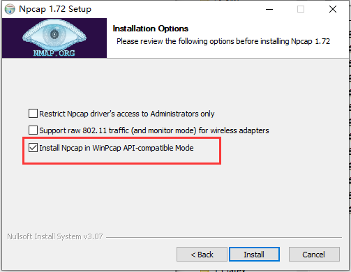
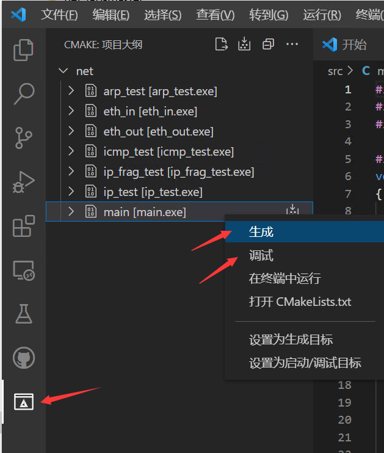

Windows开发环境搭建
==================================================

.. important:: 
   为了给同学们演示如何下载、编译、调试net-lab，我们录制了演示视频，请到bilibili上观看。
   
   【网络协议栈编译调试】 https://www.bilibili.com/video/BV1kT411q7aB/?share_source=copy_web

实验工具
~~~~~~~~~~~~~~~~~~~~~~~~~~~~~~

VSCode
------------------------------ 
Visual Studio Code 是一款功能强大的代码编辑器, 适用于几乎任何语言并可在任何操作系统上运行。通过 VSCode 的强大扩展库，我们可以在 VSCode 上一站式创建，编辑，构建，运行和调试远程主机上的工程文件，就像使用 Code::Blocks 操作本地工程一样。

在https://code.visualstudio.com/ 下载并在物理机上安装 VSCode 软件。

npcap
------------------------------ 
npcap是一个网络数据包抓包工具，它是WinPcap的改进版，支持WIndows平台的回环数据包采集和发送。

npcap下载地址：
https://npcap.com/#download

.. note:: 
   npcap版本必须大于1.0

在安装过程选择“Install Npcap in WinPcap API-compatible Mode”

cmake
------------------------------ 
CMake是一个跨平台的编译工具。它可以跨平台生成对应平台能使用的Makefile，这样我们就不用再自己去修改Makefile了，非常地方便。那它又是根据什么生成的makefile呢？就是一个叫CMakeLists.txt文件去生成Makefile，当然，这个CMakefile.txt是要我们自己编写的。本实验已经提供好了CMakefile.txt文件，可大家学习参考：）

CMake自带有ctest工具可以用于代码测试。再使用CMakefile.txt文件编译工程的时候，CTest会自动configure、build、test和展示测试结果。

CMake的下载地址：
https://cmake.org/download/

Windows 64位系统建议选择下面标红框框的版本：

.. image:: cmake.png

下载完成后，双击进行安装。在安装过程建议选择“Add CMake to the system PATH for all users”

.. image:: cmake1.png
   :scale: 70%

gcc
------------------------------ 
推荐大家安装tdm-gcc，tdm-gcc是一个Windows编译器套件，包括gcc、g++等，工具比较齐全。

tdm64-gcc下载地址：
https://github.com/jmeubank/tdm-gcc/releases/download/v10.3.0-tdm64-2/tdm64-gcc-10.3.0-2.exe

Windows下编译和调试
~~~~~~~~~~~~~~~~~~~~~~~~~~~~~~

首先下载net-lab实验包：  :ref:`协议栈编程实验代码仓库`

打开VSCode软件，在左侧边栏的扩展商店搜索并安装以下扩展：

1. Chinese (Simplified) Language Pack for Visual Studio Code
#. C/C++
#. CMake Tools

安装完成后重启VSCode。

点击打开文件夹打开工程目录后即可进行代码操作。

..  attention:: 
  确保CMakeLists.txt处于当前根目录中，也就是用VSCode软件直接打开net-lab实验包，net-lab必须是工程的根目录，否则编译不了。

.. image:: vscode2.png
   :scale: 50 %

首次配置会弹出选择编译工具的提示，选择带有GCC的选项。需要在安装tdm-gcc后才能找到GCC的选项，如果安装tdm-gcc后没有显示该选项，点击[Scan for kits] Search for compilers on this computer，搜索gcc（如果还是没有找到，建议重启电脑）。

.. image:: vscode3.png

在配置好VSCode环境之后，即可使用CMake工具栏完成编译和调试操作。

.. _调试方法:

Eth、ARP、IP或ICMP调试
------------------------------ 
协议栈的Eth、ARP、IP、ICMP协议实验支持使用GDB调试，调试步骤参考如下：

**Step1：** 首先在VSCode工程目录下打开某一个.c文件，然后点击VSCode左侧的“运行和调试（run）”工具栏，单击“运行和调试”按钮，选择“C++（Windows）”。

.. image:: gdb-1.png

**Step2：** 在弹出的对话框选择“C/C++:cl.exe 生成和调试活动文件”。（如果没有弹出该对话框，可以忽略这一步骤）

.. image:: gdb-2.png

提示找不到**.exe文件，继续打开“launch.json”文件。

.. image:: gdb-3.png

.. _launch.json说明:

**Step3：** 修改“launch.json”文件。注意，你需要修改“program”、“args”和“miDebuggerPath”这三项。（如果.vscode目录下没有生成“launch.json”文件，你也可以自行在.vscode目录下新建“launch.json”文件）

.. image:: gdb-4.png

其中，“miDebuggerPath”是你安装TDM-GCC的路径，请填写你自己的安装路径。

“program”和“args”则要根据你当前需要调试的实验进行修改。

**eth_in** ：

.. code-block:: json
   :linenos:

            "program": "${workspaceFolder}\\build\\eth_in.exe",
            "args": ["testing\\data\\eth_in"],

**eth_out** ：

.. code-block:: json
   :linenos:

            "program": "${workspaceFolder}\\build\\eth_out.exe",
            "args": ["testing\\data\\eth_out"],

**arp_test** ：

.. code-block:: json
   :linenos:

            "program": "${workspaceFolder}\\build\\arp_test.exe",
            "args": ["testing\\data\\arp_test"],

**ip_test** ：

.. code-block:: json
   :linenos:

            "program": "${workspaceFolder}\\build\\ip_test.exe",
            "args": ["testing\\data\\ip_test"],

**ip_frag_test** ：

.. code-block:: json
   :linenos:

            "program": "${workspaceFolder}\\build\\ip_frag_test.exe",
            "args": ["testing\\data\\ip_frag_test"],

**icmp_test** ：

.. code-block:: json
   :linenos:

            "program": "${workspaceFolder}\\build\\icmp_test.exe",
            "args": ["testing\\data\\icmp_test"],

以下是 **eth_in** 调试的完整的launch.json，大家可以参考下面的来修改：

.. code-block:: json
   :linenos:

   {
       "version": "0.2.0",
       "configurations": [
           {
               "name": "gcc.exe build and debug active file",
               "type": "cppdbg",
               "request": "launch",
               "program": "${workspaceFolder}\\build\\eth_in.exe",
               "args": ["testing\\data\\eth_in"],
               "stopAtEntry": false,
               "cwd": "${workspaceFolder}",
               "environment": [],
               "externalConsole": false,
               "MIMode": "gdb",
               "miDebuggerPath": "C:\\TDM-GCC-64\\bin\\gdb.exe",
               "setupCommands": [
                  {
                       "description": "Enable pretty-printing for gdb",
                       "text": "-enable-pretty-printing",
                       "ignoreFailures": true
                  }
               ],
               "preLaunchTask": "build"
           }
       ]
   }
    
**Step4：** 修改.vscode\\tasks.json文件，使得调试前能自动编译。（如果.vscode目录下没有生成“tasks.json”文件，你也可以自行在.vscode目录下新建“tasks.json”文件）

.. image:: gdb-5.png

.. code-block:: json
   :linenos:

    {
        "version": "2.0.0",
        "tasks": [
                {
                        "label": "build",
                        "type": "shell",
                        "command": "cd ${workspaceFolder}\\build; cmake --build .",
                }
        ]
    }

**Step4：** 再次单击VSCode左侧的“运行和调试（run）”工具栏，单击“gcc.exe”按钮，在代码中打上断点。比如我们想要调试ethernet_in函数，可以在该函数中打上断点，然后选择“调试”，接下来，就可以愉快地进行暂停、单步跳过、单步调试、单步跳出、重启、停止等这些调试操作了。

.. image:: gdb-6.png

.. important:: 
   当你切换成其他测试程序进行调试， **请务必记得要修改“launch.json”文件的“program”和“args”这两项参数** ，修改方法参考上述步骤：launch.json说明_

main调试
------------------------------ 
main调试有两种方法，如果第一种方法不能调试，则可以尝试使用第二种方法。

**1. CMAKE调试法：** 

当我们做到UDP实验时，需要使用main程序进行调试。main程序的调试方法和上述的Eth、ARP、IP或ICMP程序的调试方法是不一样的。如果想要对main进行编译和调试，可以在main[main.exe]这一项点击右键，再点击“生成”进行编译。

编译完成后，可以在代码行前增加断点，然后选择“调试”，接下来，也可以愉快地进行暂停、单步跳过、单步调试、单步跳出、重启、停止等这些调试操作了。

.. image:: vscode4.png

**2. Run and test调试法：** 

如果上述方式调试不了，也可以手动改一下launch.json文件。

以下是 **main** 调试的完整的launch.json，大家可以参考下面的来修改：

.. code-block:: json
   :linenos:

   {
       "version": "0.2.0",
       "configurations": [
           {
               "name": "gcc.exe build and debug active file",
               "type": "cppdbg",
               "request": "launch",
               "program": "${workspaceFolder}\\build\\main.exe",
               "args": [],
               "stopAtEntry": false,
               "cwd": "${workspaceFolder}",
               "environment": [],
               "externalConsole": false,
               "MIMode": "gdb",
               "miDebuggerPath": "C:\\TDM-GCC-64\\bin\\gdb.exe",
               "setupCommands": [
                  {
                       "description": "Enable pretty-printing for gdb",
                       "text": "-enable-pretty-printing",
                       "ignoreFailures": true
                  }
               ],
               "preLaunchTask": "build"
           }
       ]
   }

注意，"args"不需要填参数。

单击VSCode左侧的“运行和调试（run）”工具栏，单击“gcc.exe”按钮，在代码中打上断点。比如我们想要调试ethernet_in函数，可以在该函数中打上断点，然后选择“调试”，接下来，也可以愉快地进行暂停、单步跳过、单步调试、单步跳出、重启、停止等这些调试操作了。

.. image:: gdb-6.png

.. hint:: 
   协议栈的Eth、ARP、IP、ICMP协议实验提供了自测环境，该自测环境是自构建了一套读写离线数据包的驱动层，然后通过对比log和pcap文件来分析这些协议是否能收发。因此， **在Eth、ARP、IP、ICMP协议实验中，不要修改config.h头文件中的NET_IF_IP和NET_IF_MAC** 。

   但当我们做到UDP/TCP/HTTP实验时，需要用到网络上真实的UDP/TCP调试工具（或浏览器）与我们自构建的协议栈进行点对点通信，以此来测试整个网络协议栈是否能正常收发。我们的协议栈通过虚构了一张虚拟网卡，由虚拟网卡和真实网卡进行通信，这两张网卡的IP地址必须不一样（举个栗子，如果一个班级内有两位同学同名同姓，很难通过名字来区分你到底想要找谁），同时也要确保它们处于同一个网段内（不同网段的两台设备要相互通信，需要三层网络设备）。因此， **在UDP实验调试之前，必须修改include/config.h头文件中的NET_IF_IP宏定义** ，即需要自定义网卡的IP地址。
   
   自定义网卡的IP地址要求：
   
   - 该IP地址的网络号必须与你自己电脑中真实网卡的网络号一致（也就是和真实网卡处于同一个网段内）。注意：此处是 **网络号** 要和真实网卡一致，以确保它们处在同一个网段内， **不是将自定义网卡（虚拟网卡）的IP地址设置成真实网卡的IP地址** 。关于网络地址（网络号）说明可参考 :doc:`/lab5/index` 的实验原理部分。
   - 该IP地址的主机号必须与真实网卡的主机号不一样，以确保两张网卡的IP地址不一样。

   .. image:: vscode5.png   
