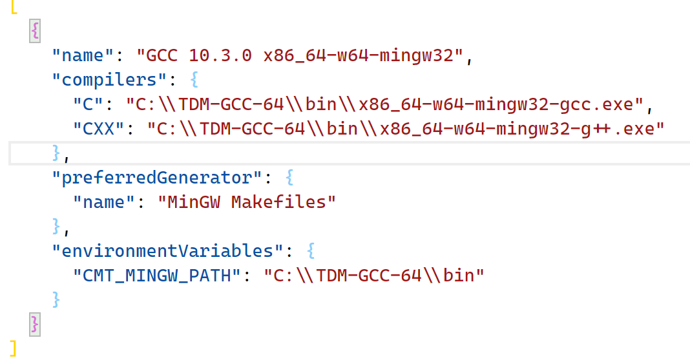
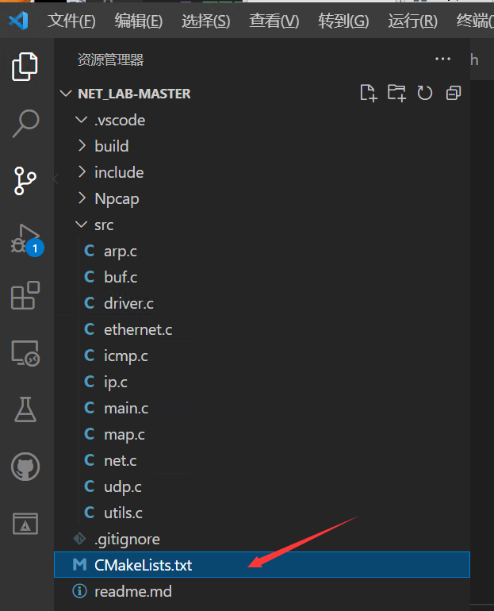

Lab2 常见问题
================================================

.. toctree::
   :hidden:
   :maxdepth: 5

安装完CMAKE和TDM GCC后，VSCode的CMAKE上找不到项目的可执行程序？
~~~~~~~~~~~~~~~~~~~~~~~~~~~~~~~~~~~~~~~~~~~~~~~~~~~~~~~~~~~~~~~~~~~

如下图所示，找不到项目的可执行程序。

.. image:: lab2.png
   :scale: 50 %

首先，你需要先检查 "C:\\Users\\你自己电脑的用户名\\AppData\\Local\\CMakeTools\\CMakeTools-tools-kits.json"文件，该文件正常的配置应该如下图所示。

如果你电脑中该文件的gcc不一样，比如是C:\\\TDM-GCC-64\\\bin\\\gcc.exe。你可以参考以下步骤来修改：

单击VSCode的左下角齿轮图标，选择“设置”。

.. image:: lab2-6.png

在弹出的窗口中输入“cmake generator”，然后在“Cmake: Generator 要使用的CMake生成器”中输入“MinGW Makefiles”，将Cmake生成器强制指定为MinGW Makefiles。

.. image:: lab2-7.png

点击VSCode最下方的“GCC图标”，重新扫描[Scan for kits]，重新选择GCC，应该选择的是C:\\TDM-GCC-64\\bin\\x86_64-w64-mingw32-gcc.exe。

.. image:: lab2-4.png

.. image:: lab2-3.png

如果还不行，删掉本工程目录下的.vscode\\settings.json文件，再重新扫描[Scan for kits]。

CMake报错
~~~~~~~~~~~~~~~~~~~~~~~~~~~~~~~~~~~~~~~~~~~~~~~~~~~~~~~~~~~~~~~~~~~
CMake报错的情况以下几种情况：

1、首先参考上一题的解决方案，先确保GCC是选对了。

2、检测一下你的工程目录是不是实验包的根目录。

正常的VSCode工程目录应该是这样的：

下图的工程目录是不对的：

.. image:: lab2-8.png

同学们可以自行检查。

ctest运行报错
~~~~~~~~~~~~~~~~~~~~~~~~~~~~~~~~~~~~~~~~~~~~~~~~~~~~~~~~~~~~~~~~~~~
如果出现下图的情况，一般是代码有段错误了，可以用GDB跟踪调试。

.. image:: lab2-9.png
