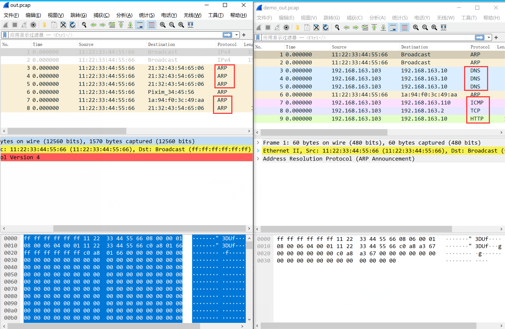
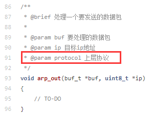

Lab3 常见问题（ARP）
================================================

.. toctree::
   :hidden:
   :maxdepth: 5

out.pcap和demo.pcap文件对不上？
~~~~~~~~~~~~~~~~~~~~~~~~~~~~~~~~~~~~~~~~~~~~~~
有同学在调试arp_test时，提示pcap与demo的不一样，如下图所示：

从这个图来看，主要的问题是Protocol字段没有填对，也就是，调用arp_out函数发送的数据包不一定都是arp协议报文，还有可能是IP协议报文。

IP协议报文从网络层往下发送时，它不能直接发给数据链路层。主要原因是数据链路层不使用IP地址，而只使用MAC地址传输数据包。因此，必须先了解发送端/接收端MAC地址。如果不知道MAC地址，那么通信也无从谈起。

那么如何才能了解每个IP地址对应的MAC地址，这正是ARP协议要解决的问题。因此，IP协议报文从网络层往下发送时，它必然得先去查一下ARP表，找到IP地址对应的MAC地址后，才能往下发给数据链路层，封装MAC头部，并将数据帧发送出去。

因此本协议栈的发送流程应该是：ip_out() --> ip_fragment_out() --> arp_out() -->  ethernet_out() --> driver_send()

那有同学可能问，为什么arp_out()函数中上层协议类型一定是IP协议，不能是其他协议吗？因为本协议栈是基于TCP/IP协议模型，网络层主要通过IP协议来实现数据包的传输（当然还需要众多支持IP的相关辅助技术，如ARP、ICMP等等），传输层中的TCP/UDP协议也都是在网络层的IP协议的基础上的。故，本协议栈arp_out()函数中上层协议类型只需关注IP协议即可。

arp_in函数这第二个参数src_mac和buf里面arp报文的sender_mac有什么区别？
~~~~~~~~~~~~~~~~~~~~~~~~~~~~~~~~~~~~~~~~~~~~~~~~~~~~~~~~~~~~~~~~~~~~~
如下图：

这两个参数应该是一样的。