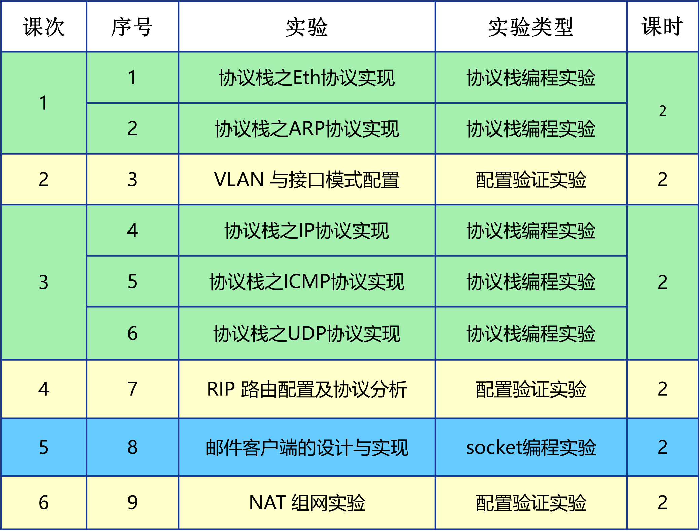

计算机网络实验简介
==================================================

实验安排
~~~~~~~~~~~~~~~~~~~~~~~~~~~~~~
本学期计算机网络实验有6次实验课，每次实验课2个学时，总共12个学时，实验内容涵盖有 **编程设计型** 和 **配置验证型** 两种类型，总共9个小实验。

**编程设计型实验** （需自己动手编程）有两种系列：

I. 协议栈编程实验，该系列实验需要在本课程提供的代码框架上，实现以太网收发 → ARP 解析 → IP 协议实现 → ping 响应 → UDP 实现。此外，我们也特别鼓励有兴趣的同学能在此基础上增加TCP协议实现、RIP路由协议实现（若能完成会有意想不到的惊喜！）。网络编程实验环境的安装和配置详见附录B :doc:`网络编程实验环境 <../appendix-b/index>` 。
#. Socket编程实验: 邮件客户端的设计与实现。

**配置验证型实验**：VLAN与接口模式配置、RIP路由配置及协议分析、NAT组网实验。验证型实验必须在本实验课程提供的实验环境下完成。

