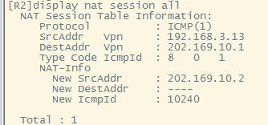
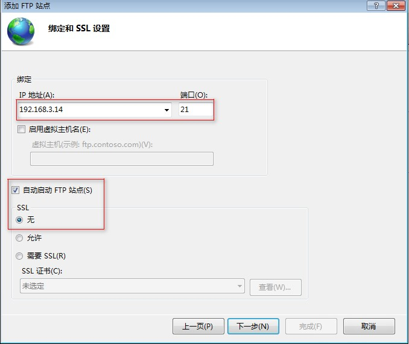
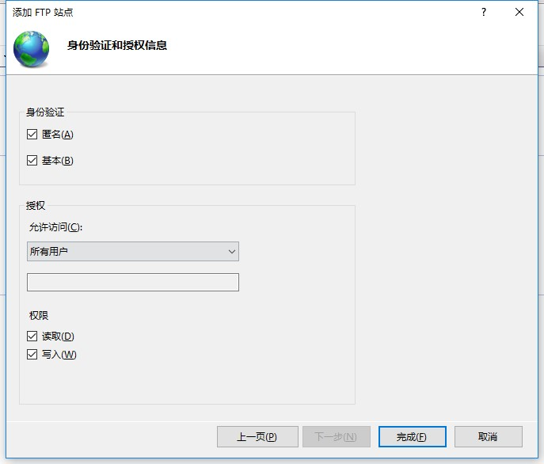
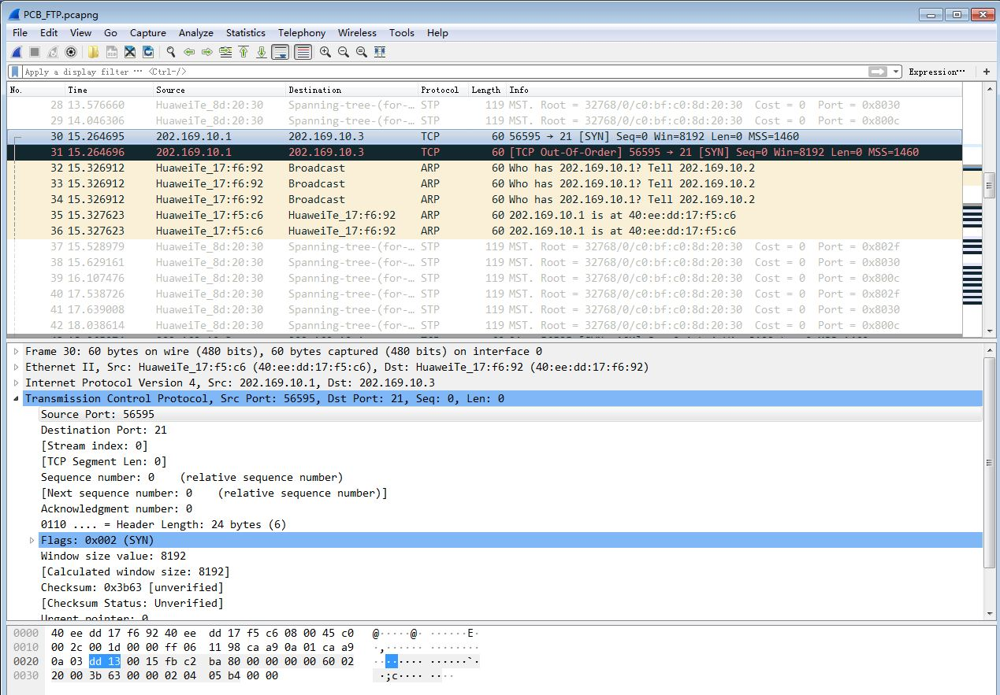

实验目的
=====================

1. 了解网络地址转换的工作原理，掌握网络地址转换的配置方法。

实验任务
=====================
掌握静态NAT、动态NAT、NAPT、NAT Server-NAT的配置方法，在计算机上用Wireshark截取ftp报文，理解NAT地址转换技术的原理。

实验原理
=====================

NAT概要
~~~~~~~~~~~~~~~~~~~~~~~~~~~~~~
网络地址转换NAT（Network Address Translator）技术是在1994年提出的，主要是为了解决全球 IPv4地址短缺的问题，它将多个内部私有地址映射为少数几个甚至一个公网IP地址，以减少公网IP地址的使用。同时，NAT还起到了隐藏内部网络结构的作用，对内网主机而言具有一定的安全性。

本实验需要完成4种NAT技术的配置：静态NAT（Static NAT）、动态地址NAT（Pooled NAT）、网络地址与端口转换NAPT（Network Address and Port Translation）、NAT Server-NAT 服务器技术。

静态NAT
~~~~~~~~~~~~~~~~~~~~~~~~~~~~~~
静态NAT实现了私有地址和共有地址的一对一映射，其设置最简单、最容易实现的。如果希望一台主机优先使用某个关联地址，或者想要外部网络使用一个指定的公网地址访问内部服务器时，可以使用静态NAT。然而，一个公网IP只会分配给唯一且固定的内网主机，不节省IP地址。

动态NAT
~~~~~~~~~~~~~~~~~~~~~~~~~~~~~~
动态NAT是基于地址池来实现私有地址和公有地址的转换。

.. image:: NAT动态.png

当内部主机A和主机B需要与公网种的目标地址通信时，网关RTA会从公网地址池种选择一个未使用的公网地址与之做映射。当网关收到回复报文后，会根据之前的映射再次进行转换之后发给对应主机。当不需要此连接时，对应的地址映射将会删除，公网地址也会被恢复到地址池中待用。

缺点：动态NAT地址池中的地址用尽以后，只能等待被占用的公用IP释放后，其他主机才能使用它来访问公网。

静态NAT和动态NAT合成基本NAT，要求同一时刻被映射的内部主机数小于或等于所拥有的外网IP地址数。

NAPT网络地址端口转换
~~~~~~~~~~~~~~~~~~~~~~~~~~~~~~
NAPT允许多个内部地址映射到同一个公有地址的不同端口。它主要利用TCP/UDP的端口实现多个私网地址到1个公网IP地址的映射，其映射形式如下：

（私网IP，TCP/UDP端口号） <-->（公网IP，TCP/UDP端口号）

网络层的ICMP没有端口号，NAPT设备需要对带标记ID字段的ICMP报文单独建立地址映射，其形式为：

（私网IP，ICMP ID号） <-->（公网IP，ICMP ID号）

.. image:: NAPT1.png

.. image:: NAPT2.png

上图描述了内部主机PCA与外网主机PCB应用地址转换NAPT技术进行通信的过程。其中，内部网络是10.0.1.0/24网段，出口NAT路由器的公网地址只有202.0.0.1一个地址，并且其地址池也只有这唯一的IPv4地址。

（1）当内部主机PCA向外网主机PCB发送一个FTP连接请求，这时从PCA发出的报文的源IP地址是10.0.1.10，源端口号是1001，目的地址是PCB的IP地址6.1.128.10，目的端口号是21。

（2）当这个报文被转发到出口NAT路由器时，NAT路由器就会先查看公网地址池，然后再地址转换表中插入一条记录，分别是转换前的源地址、源端口号和转换后的源地址、源端口号。

（3）NAT路由器按照转换后的源地址和源端口号来重新封装报文，目的地址和端口号不变，并将新报文从出接口发送出去。

（4）当报文被转发到PCB时，PCB收到报文后，会针对该FTP请求报文，发送应答报文，此时PCB应答报文的源地址是PCB的IP地址6.1.128.10，源端口号是21；目的地址和源端口号是转换后的IP地址202.0.0.1和端口号1044。

（5）当这个报文被转发到出口NAT路由器时，路由器根据报文的目的地址和端口号，在将报文转发到内网之前，要先查找地址转换表进行地址转换。将目的地址和端口号转换成内网本地地址10.0.1.10和内网端口号1001，才能保证PCA能够收到应答报文。

（6）路由器将报文重新封装后，将应答报文发送到内部网络，直至报文被转发到PCA。

这就是内网、外网主机之间通过地址转换技术进行通信的基本过程。

NAT Server-NAT 服务器技术
~~~~~~~~~~~~~~~~~~~~~~~~~~~~~~
通过配置NAT服务器,可以使外网用户访问内网服务器。

NAT在使内网用户访问公网的同时，也屏蔽了公网用户访问私网主机的需求。当一个私网需要向公网用户提供Web和SFTP服务时，私网中的服务器必须随时可供公网用户访问。

需要配置服务器私网IP地址和端口号转换为公网IP地址和端口号并发布出去。路由器在收到一个公网主机的请求报文后，根据报文的目的IP地址和端口号查询地址转换表项。路由器根据匹配的地址转换表项，将报文的目的IP地址和端口号转换成私网IP地址和端口号，并转发报文到私网中的服务器。

.. image:: NAT服务器.png

过程分析：主机C需要访问私网服务器，发送报文的目的IP地址是200.10.10.1，目的端口号是80。RTA收到此报文后会查找地址转换表项，并将目的IP地址转换成192.168.1.1，目的端口号保持不变。服务器收到报文后会进行响应，RTA收到私网服务器发来的响应报文后，根据报文的源IP地址192.168.1.1和端口号80查询地址转换表项。然后，路由器根据匹配的地址转换表项，将报文的源IP地址和端口号转换成公网IP地址200.10.10.1和端口号80，并转发报文到目的公网主机。

实验环境与分组
=====================

路由器2台，二层交换机1台，三层交换机1台，计算机3台，4人一组。

实验组网
=====================

.. image:: 8-3.jpg

IP地址表：

==============     =========================
设备名称    	        IP地址    
==============     =========================
R1-G0/0/9          202.169.10.1/24 
R2-G0/0/9          202.169.10.2/24
R2-G0/0/0          192.168.3.1/24 
PCB     		       202.169.10.100/24
PCC     		       192.168.3.13/24 
PCD（Server）      192.168.3.14/24 
==============     =========================

实验步骤
=====================

登陆设备
~~~~~~~~~~~~~~~~~~~~~~~~~~~~~~

Step1：
------------------------------
打开SecureCRT，点击窗口中的“快速连接”图标，如图所示：

.. image:: 1-2.jpg

Step2：
------------------------------
在弹出的窗口中，输入需通过telnet访问的设备IP（见表 :ref:`ATM管理机地址表` ）和端口号，然后点击“连接”即可。

.. image:: 1-3.jpg

.. _ATM管理机地址表:

.. list-table:: ATM管理机地址表
   :widths: 20 30
   :header-rows: 1
   :align: center

   * - 机柜编号
     - ATM管理路由器的IP地址
   * - 1
     - 10.251.130.241
   * - 2
     - 10.251.130.242
   * - 3
     - 10.251.130.243
   * - 4
     - 10.251.130.244
   * - 5
     - 10.251.130.245
   * - 6
     - 10.251.130.246
   * - 7
     - 10.251.130.247
   * - 8
     - 10.251.130.248
   * - 9
     - 10.251.130.249
   * - 10
     - 10.251.130.250

.. hint:: 
  
    交换机 **不需要输入用户名和密码** 。
    
    路由器R1和R2的  **用户名：admin，密码：Admin@huawei** 

.. image:: 2-3.jpg

Step3：
------------------------------
登录成功后，即进入用户视图。在用户视图下，用户可以完成查看运行状态和统计信息等功能，此时屏幕上显示:

.. image:: 1-5.jpg

清空配置
~~~~~~~~~~~~~~~~~~~~~~~~~~~~~~
每次做实验前，先清空上一次的配置，本次实验需清空R1、R2、SW1、SW2、SW3的配置。  

Step1：
------------------------------

在用户视图下，使用如下命令进行配置的清空

.. code-block:: sh
   :emphasize-lines: 1-12
   :linenos:

   reset saved-configuration //清除配置
   The device configurations will be erased to reconfigure. Are you sure?(y/n):y //输入y继续删除
   display saved-configuration //查看删除后的配置

查看删除后的配置：

.. image:: 2-4.jpg

Step2：
------------------------------
在用户视图下，使用如下命令进行重启

.. code-block:: sh
   :emphasize-lines: 1-12
   :linenos:

   reboot //重启
   All the configuration will be saved to the next startup configuration. Continue? [y/n]:n //输入n不保存到启动配置
   System will reboot! Continue? [y/n]: //输入y，继续重新启动
   display current-configuration //重启后查看当前配置

.. image:: 2-5.jpg

导入初始配置
~~~~~~~~~~~~~~~~~~~~~~~~~~~~~~

R1导入下列配置

.. code-block:: sh
   :emphasize-lines: 1-12
   :linenos:

    system-view 
    sysname R1
    user-interface console 0
    idle-timeout 60
    quit
    int G0/0/9
    undo ip add
    quit
    int G0/0/8
    shutdown
    quit
    quit

R2导入下列配置
	
.. code-block:: sh
   :emphasize-lines: 1-12
   :linenos:

    system-view 
    sysname R2
    user-interface console 0
    idle-timeout 60
    quit
    int G0/0/9
    undo ip add
    quit
    int G0/0/8
    shutdown
    quit
    quit
    
SW1导入下列配置

.. code-block:: sh
   :emphasize-lines: 1-16
   :linenos:

    system-view 
    sysname SW1
    user-interface console 0
    idle-timeout 60
    quit
    int range G0/0/1 to G0/0/4
    shutdown
    quit
    observe-port 1 interface GigabitEthernet 0/0/12 
    interface GigabitEthernet 0/0/47   
    port-mirroring to observe-port 1 both
    interface GigabitEthernet 0/0/48  
    port-mirroring to observe-port 1 both
    display observe-port
    quit
    quit

SW2导入下列配置
	
.. code-block:: sh
   :emphasize-lines: 1-12
   :linenos:

    system-view 
    sysname SW2
    user-interface console 0
    idle-timeout 60
    quit
    int range G0/0/1 to G0/0/4
    shutdown
    quit
    quit

SW3导入下列配置

.. code-block:: sh
   :emphasize-lines: 1-12
   :linenos:

    system-view
    sysname SW3
    user-interface console 0
    idle-timeout 60
    quit
    int range G0/0/1 to G0/0/4
    shutdown
    quit
    quit

导入信息步骤如下图所示：
复制以上的代码并分别粘贴入SW2、SW3。

.. image:: 2-6.jpg

.. image:: 2-7.jpg

配置计算机的网关
~~~~~~~~~~~~~~~~~~~~~~~~~~~~~~

配置PCC和PCD网关。注意，一台电脑只能有一个默认网关，需要把“本地连接2”的默认网关删掉，才能配置“本地连接”的默认网关。

PCC和PCD网关都为192.168.3.1。

PCC和PCD通过默认网关将数据交给R2。
	
配置路由器的基本信息
~~~~~~~~~~~~~~~~~~~~~~~~~~~~~~

Step1：
------------------------------
登录R1使用下列命令进行基本信息配置：

.. code-block:: sh
   :emphasize-lines: 1-12
   :linenos:

    system-view //进入系统视图
    interface G0/0/9  //进入G0/0/9接口
    ip address 202.169.10.1 255.255.255.0 //为G0/0/9配置202.169.10.1/24的IP地址
    quit //退出接口

Step2: 
------------------------------
登录R2使用下列命令进行基本信息配置：

.. code-block:: sh
   :emphasize-lines: 1-12
   :linenos:

    system-view //进入系统视图
    interface G0/0/9  //进入G0/0/9接口
    ip address 202.169.10.2 255.255.255.0 //为G0/0/9配置202.169.10.2/24的IP地址
    quit //退出接口
    interface G0/0/0 //进入G0/0/0接口
    undo portswitch //启用三层接口
    ip address 192.168.3.1 255.255.255.0 //为G0/0/0配置IP地址
    quit //退出接口

Step3: 
------------------------------
配置完成后，在R2上ping R1验证连通性，如图：

.. image:: 8-4.jpg

配置静态NAT端口映射
~~~~~~~~~~~~~~~~~~~~~~~~~~~~~~

Step1：
------------------------------
在PCC上ping R1，结果是无法访问 

.. image:: 8-5.jpg

Step2：
------------------------------
登录R2使用下列命令进行基本信息配置：

.. code-block:: sh
   :emphasize-lines: 1-12
   :linenos:

    interface G0/0/9  //进入G0/0/9接口
    nat static global 202.169.10.3 inside 192.168.3.13 //将公网地址202.169.10.3映射到PCA
    quit //退出接口

.. hint:: 
   在内部本地与外部合法地址之间建立静态地址转换的格式：
   
   nat static global  外部合法地址　内部本地地址

	
Step3：
------------------------------
在PCC上使用ping R1，结果可以访问了，如图：

.. image:: 8-6.jpg

Step4：
------------------------------
在R2上使用命令“display nat static”查看nat地址转换表

.. image:: 8-7.jpg

配置动态NAT
~~~~~~~~~~~~~~~~~~~~~~~~~~~~~~

Step1：
------------------------------
在进行新的nat配置之前，先清除R2之前的配置

.. code-block:: sh
   :emphasize-lines: 1-12
   :linenos:

    interface G0/0/9  //进入G0/0/9接口
    undo nat static global 202.169.10.3 inside 192.168.3.13 //取消公网地址202.169.10.3映射到   PCA
    quit //退出接口

Step2：
------------------------------
在R2的系统视图下使用下列命令进行基本信息配置：

.. code-block:: sh
   :emphasize-lines: 1-12
   :linenos:

    acl 2000  //创建访问控制列表2000
    rule 1 permit source 192.168.3.0 0.0.0.255 //定义规则允许192.168.3.0网段的通过
    quit //退出接口
    nat address-group 1 202.169.10.5 202.169.10.10 //配置nat地址池为202.169.10.5 到202.169.10.    10
    interface g0/0/9 //进入g0/0/9接口
    nat outbound 2000 address-group 1 //在接口内应用nat转换
    quit //退出接口

Step3：
------------------------------
在PCC上ping R1，如图：

.. image:: 8-8.jpg

Step4：
------------------------------
在R2上使用命令“display nat session all”查看nat地址转换表

.. image:: 8-9.jpg

每次查看之前需要ping一次

配置NAT端口复用
~~~~~~~~~~~~~~~~~~~~~~~~~~~~~~

Step1：
------------------------------
在进行新的nat配置之前，先清除R2之前的配置

.. code-block:: sh
   :emphasize-lines: 1-12
   :linenos:

    interface G0/0/9  //进入G0/0/9接口
    undo nat outbound 2000 address-group 1 //取消在接口内应用nat转换
    quit //退出接口
    undo acl 2000 //取消访问控制列表2000
    undo nat address-group 1 //取消nat address group

Step2：
------------------------------
登录R2使用下列命令进行基本信息配置：

.. code-block:: sh
   :emphasize-lines: 1-12
   :linenos:

    acl 2000  //创建访问控制列表2000
    rule 1 permit source 192.168.3.0 0.0.0.255 //定义规则允许192.168.3.0网段的通过
    quit //退出接口
    interface G0/0/9 //进入G0/0/9接口
    nat outbound 2000  //在接口内应用nat
    quit //退出接口

Step3：
------------------------------
配置完成后，在PCC上使用ping R1命令测试网络连通性：

.. image:: 8-10.jpg

Step4：
------------------------------
在R2上使用命令“display nat session all”查看nat地址转换表

每次ping一次，查看一次，IP地址都不会改变，但是icmpid会变化。

配置NAT Server
~~~~~~~~~~~~~~~~~~~~~~~~~~~~~~

Step1：
------------------------------
在进行新的nat配置之前，先清除R2之前的配置

.. code-block:: sh
   :emphasize-lines: 1-12
   :linenos:

    interface G0/0/9  //进入G0/0/9接口
    undo nat outbound 2000 //取消在接口内应用nat转换
    quit //退出接口
    undo acl 2000 //取消访问控制列表2000

Step2：
------------------------------
登录R2使用下列命令进行基本信息配置：
使用NAT Server命令定义内部服务器映射表，指定服务器通信协议为TCP类型，端口号为21

.. code-block:: sh
   :emphasize-lines: 1-12
   :linenos:

    interface G0/0/9  //进入G0/0/9接口
    nat server protocol tcp global 202.169.10.3 ftp inside 192.168.3.14 ftp //将公网地址202.   169.10.3映射到PCD上，指定端口号为21，该常用端口号可以直接使用关键字"ftp"代替。
    quit //退出接口

Step3：
------------------------------
在R2上使用命令“display nat server”查看nat地址转换表

.. image:: 8-12.jpg

Step4：
------------------------------
在PCD上新建test用户

打开命令行界面，新建test用户,密码为test，输入：net user test test /add

.. image:: 8-29.jpg

step5：
------------------------------
在PCD电脑的D盘上，新建lab目录

Step6：
------------------------------
在PCD上，打开控制面板—程序与功能—打开或关闭windows功能,找到Internet信息服务下的ftp和iis

.. image:: 8-14.jpg

在IIS控制面板里添加FTP站点

Step7：
------------------------------
打开系统和安全里的管理工具

.. image:: 8-15.jpg

Step8：
------------------------------
打开Internet信息服务（IIS）管理器

.. image:: 8-16.jpg

Step9：
------------------------------
如图右键添加FTP站点

.. image:: 8-17.jpg

Step10：
------------------------------
添加站点名称和路径，路径为本机存放文件路径

.. image:: 8-18.jpg

Step11：
------------------------------
IP地址为本机IP地址，ssl选择无，这里我们为本地传输，无需ssl

此时可以看到网站下面有自己创建的lab

.. image:: 8-21.jpg

抓取ftp传输包
~~~~~~~~~~~~~~~~~~~~~~~~~~~~~~

step 1：
------------------------------
在PCB和PCD打开wireshark软件，选用本地连接，过滤规则为ftp

step 2：
------------------------------
在R1上模拟公网用户访问服务器，使用命令 ftp 202.169.10.3

.. image:: 8-24.jpg

PCB报文:

PCD报文:

.. image:: 8-23.jpg

Step3：
------------------------------
在R2上使用命令“display nat server”查看nat地址转换表

.. image:: 8-25.jpg

请分析PCB和PCD的报文体会NAT Server地址转换技术的原理。
