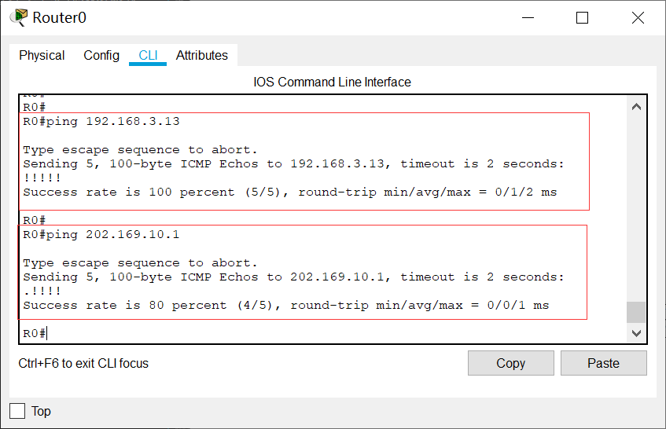
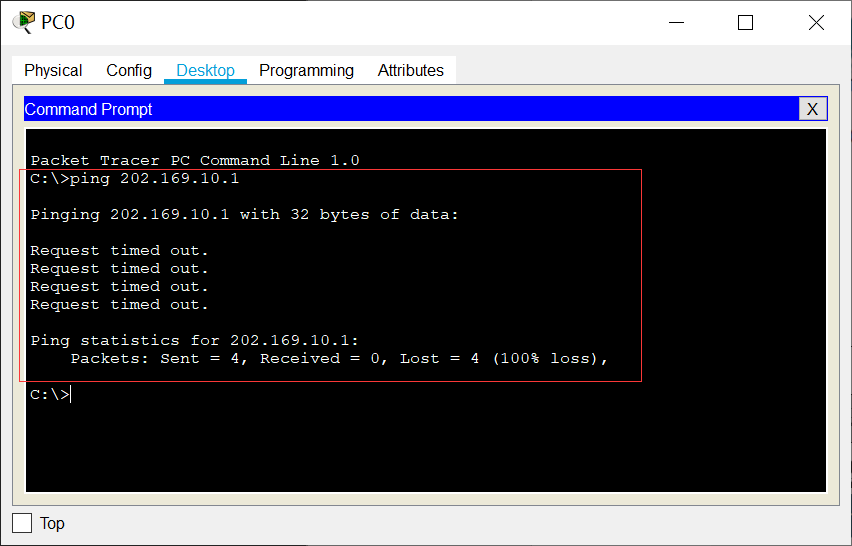
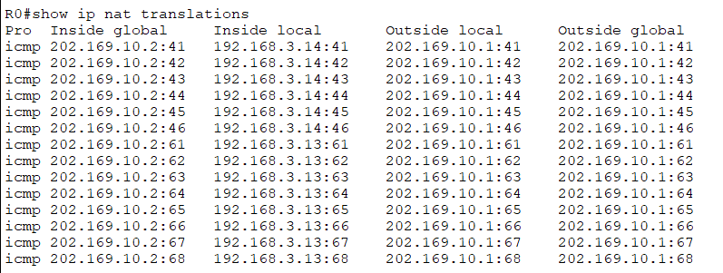
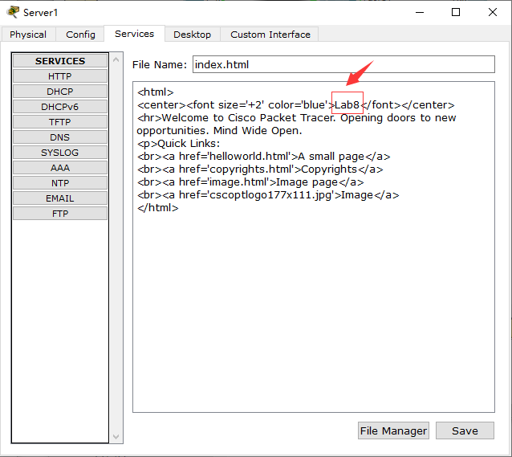
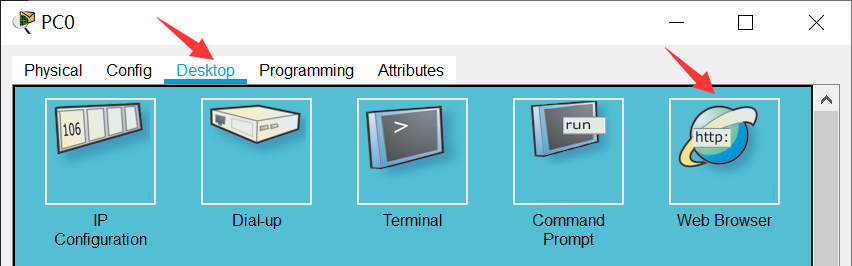

实验目的
=====================

1. 了解网络地址转换的工作原理，掌握网络地址转换的配置方法。

实验任务
=====================
掌握静态NAT、动态NAT、NAPT、NAT Server-NAT的配置方法，在cisc packet tracer上截取ftp报文，理解NAT地址转换技术的原理。

实验原理
=====================

NAT概要
~~~~~~~~~~~~~~~~~~~~~~~~~~~~~~
网络地址转换NAT（Network Address Translator）技术是在1994年提出的，主要是为了解决全球 IPv4地址短缺的问题，它将多个内部私有地址映射为少数几个甚至一个公网IP地址，以减少公网IP地址的使用。同时，NAT还起到了隐藏内部网络结构的作用，对内网主机而言具有一定的安全性。

本实验需要完成4种NAT技术的配置：静态NAT（Static NAT）、动态地址NAT（Pooled NAT）、网络地址与端口转换NAPT（Network Address and Port Translation）、NAT Server-NAT 服务器技术。

静态NAT
~~~~~~~~~~~~~~~~~~~~~~~~~~~~~~
静态NAT实现了私有地址和共有地址的一对一映射，其设置最简单、最容易实现的。如果希望一台主机优先使用某个关联地址，或者想要外部网络使用一个指定的公网地址访问内部服务器时，可以使用静态NAT。然而，一个公网IP只会分配给唯一且固定的内网主机，不节省IP地址。

动态NAT
~~~~~~~~~~~~~~~~~~~~~~~~~~~~~~
动态NAT是基于地址池来实现私有地址和公有地址的转换。

.. image:: NAT动态.png

当内部主机A和主机B需要与公网种的目标地址通信时，网关RTA会从公网地址池种选择一个未使用的公网地址与之做映射。当网关收到回复报文后，会根据之前的映射再次进行转换之后发给对应主机。当不需要此连接时，对应的地址映射将会删除，公网地址也会被恢复到地址池中待用。

缺点：动态NAT地址池中的地址用尽以后，只能等待被占用的公用IP释放后，其他主机才能使用它来访问公网。

静态NAT和动态NAT合成基本NAT，要求同一时刻被映射的内部主机数小于或等于所拥有的外网IP地址数。

NAPT网络地址端口转换
~~~~~~~~~~~~~~~~~~~~~~~~~~~~~~
NAPT允许多个内部地址映射到同一个公有地址的不同端口。它主要利用TCP/UDP的端口实现多个私网地址到1个公网IP地址的映射，其映射形式如下：

（私网IP，TCP/UDP端口号） <-->（公网IP，TCP/UDP端口号）

.. _ICMP端口说明:

网络层的ICMP没有端口号，NAPT设备需要对带标记ID字段的ICMP报文单独建立地址映射，其形式为：

（私网IP，ICMP ID号） <-->（公网IP，ICMP ID号）

.. image:: NAPT1.png

.. image:: NAPT2.png

上图描述了内部主机PCA与外网主机PCB应用地址转换NAPT技术进行通信的过程。其中，内部网络是10.0.1.0/24网段，出口NAT路由器的公网地址只有202.0.0.1一个地址，并且其地址池也只有这唯一的IPv4地址。

（1）当内部主机PCA向外网主机PCB发送一个FTP连接请求，这时从PCA发出的报文的源IP地址是10.0.1.10，源端口号是1001，目的地址是PCB的IP地址6.1.128.10，目的端口号是21。

（2）当这个报文被转发到出口NAT路由器时，NAT路由器就会先查看公网地址池，然后再地址转换表中插入一条记录，分别是转换前的源地址、源端口号和转换后的源地址、源端口号。

（3）NAT路由器按照转换后的源地址和源端口号来重新封装报文，目的地址和端口号不变，并将新报文从出接口发送出去。

（4）当报文被转发到PCB时，PCB收到报文后，会针对该FTP请求报文，发送应答报文，此时PCB应答报文的源地址是PCB的IP地址6.1.128.10，源端口号是21；目的地址和源端口号是转换后的IP地址202.0.0.1和端口号1044。

（5）当这个报文被转发到出口NAT路由器时，路由器根据报文的目的地址和端口号，在将报文转发到内网之前，要先查找地址转换表进行地址转换。将目的地址和端口号转换成内网本地地址10.0.1.10和内网端口号1001，才能保证PCA能够收到应答报文。

（6）路由器将报文重新封装后，将应答报文发送到内部网络，直至报文被转发到PCA。

这就是内网、外网主机之间通过地址转换技术进行通信的基本过程。

NAT Server-NAT 服务器技术
~~~~~~~~~~~~~~~~~~~~~~~~~~~~~~
NAT在使内网用户访问公网的同时，也屏蔽了公网用户访问私网主机的需求。当一个私网需要向公网用户提供Web和SFTP等服务时，私网中的服务器必须随时可供公网用户访问。

通过配置NAT服务器可以使外网用户访问内网服务器。需要配置服务器私网IP地址和端口号转换为公网IP地址和端口号并发布出去。路由器在收到一个公网主机的请求报文后，根据报文的目的IP地址和端口号查询地址转换表项。路由器根据匹配的地址转换表项，将报文的目的IP地址和端口号转换成私网IP地址和端口号，并转发报文到私网中的服务器。

.. image:: NAT服务器.png

过程分析：主机C需要访问私网服务器，发送报文的目的IP地址是200.10.10.1，目的端口号是80。RTA收到此报文后会查找地址转换表项，并将目的IP地址转换成192.168.1.1，目的端口号保持不变。服务器收到报文后会进行响应，RTA收到私网服务器发来的响应报文后，根据报文的源IP地址192.168.1.1和端口号80查询地址转换表项。然后，路由器根据匹配的地址转换表项，将报文的源IP地址和端口号转换成公网IP地址200.10.10.1和端口号80，并转发报文到目的公网主机。

实验环境与分组
=====================

路由器1台，二层交换机2台，计算机2台，服务器2台。

实验组网
=====================

.. image:: cisco-1.png

IP地址表：

==============     =========================
设备名称    	        IP地址    
==============     =========================
Router0-G0/0        192.168.3.1/24 
Router0-G0/1        202.169.10.2/24
PC0                 192.168.3.13/24 
PC1     		        202.169.10.100/24
Server0    		      192.168.3.14/24 
Server1             202.169.10.1/24 
==============     =========================

实验步骤
=====================

搭建网络拓扑
~~~~~~~~~~~~~~~~~~~~~~~~~~~~~~~~~
打开Cisco Packet Tracer软件绘制出组网图。

Router0路由器型号：1941

Switch0和Switch1交换机型号：2960-24TT

.. note:: 
  路由器和路由器之间的连接线需要使用Copper Cross Over(交叉线)。交换机和路由器、交换机和计算机使用Copper Straight-Through(直通线)

  搭建完网络拓扑图后，记得保存好！

配置PC和服务器的IP地址
~~~~~~~~~~~~~~~~~~~~~~~~~~~~~~

按照下表设置PC0、PC1和PC2这三台电脑的IP地址。

========    =====================   =====================  
计算机            IP地址                  网关
========    =====================   =====================  
PC0           192.168.3.13/24           192.168.3.1
Server0	      192.168.3.14/24           192.168.3.1
PC1           202.169.10.100/24         （可以不用设置网关）
Server1       202.169.10.1/24           （可以不用设置网关）
========    =====================   =====================  

注：本实验中的外网IP同属一个网段内，可以不用设置网关。

.. attention:: 请思考，内网和外网的IP地址能否编在同一个网段？

   *（请把答案写到实验报告中）*

以设置Server0的IP为例，单击Server0图标，在弹出的窗口里点击“Desktop”选项卡，点击“IP Configuration”图标，然后在出现的窗口界面里填写IP address和Subnet Mask。

.. image:: cisco-2.png

.. image:: cisco-3.png  

配置路由器基本信息
~~~~~~~~~~~~~~~~~~~~~~~~~~~~~~~~~

登录Router0使用下列命令进行基本信息配置：

.. code-block:: sh
   :linenos:

   Router>enable
   Router#configure terminal 
   Router(config)#hostname R0 // 重命名为R0
   R0(config)#no ip domain-lookup  // 用于防止DNS解析的命令。如果没有这条命令，当你输入错误的命令时，cisco会尝试连接DNS服务器进行域名解析，浪费时间。   

   R0(config)#interface g0/0   // 进入g0/0接口模式
   R0(config-if)#ip address 192.168.3.1 255.255.255.0 //配置g0/0接口ip地址
   R0(config-if)#no shutdown // 打开g0/0接口（默认接口关闭）
   R0(config-if)#exit

   R0(config)#interface g0/1  // 进入g0/1接口模式
   R0(config-if)#ip address 202.169.10.2 255.255.255.0  //配置g0/1接口ip地址
   R0(config-if)#no shutdown  // 打开g0/1接口（默认接口关闭）
   R0(config-if)#exit
   R0(config)#

配置完成后，可以查看一下R0路由表:

.. image:: cisco-stu-1.png 

路由表上有两条直连路由，分别是192.168.3.0/24网段和202.169.10.0/24网段。

此时，在R0上验证PC0的连通性，在R0上验证Server1的连通性，如图：

在PC0上验证Server1的连通性，如图：

.. attention:: 请思考，此时为什么在R0上能ping通PC0和Server1，但是PC0却ping不通Server1？
   
   *（请把答案写到实验报告中）*

配置静态NAT映射
~~~~~~~~~~~~~~~~~~~~~~~~~~~~~~

配置R0的静态NAT
------------------------------

登录R0使用下列命令进行基本信息配置：

.. code-block:: sh
   :linenos:

   R0(config)#interface g0/1  // 进入G0/1接口
   R0(config-if)#ip nat outside  // 将端口G0/1设置为外网出口模式
   R0(config-if)#exit

   R0(config)#interface g0/0  // 进入G0/0接口
   R0(config-if)#ip nat inside // 将端口G0/0设置为内网入口模式
   R0(config-if)#exit

   R0(config)#ip nat inside source static 192.168.3.13 202.169.10.2 // 将PC0映射到公网地址202.169.10.2上
   R0(config)#exit  // 退出配置模式
   R0#

.. hint:: 
   在内部本地地址与内部全局地址之间建立静态地址转换的格式：
   
   ip nat inside source static 内部全局地址　内部本地地址

在R0上使用命令“show ip nat translations”查看nat地址转换表

.. image:: cisco-9.png 	

.. hint:: 
  
  **NAT地址表解释**

  NAT转换表内容依次为：Pro（协议类型）、Inside global（内部全局地址及端口）、Inside local（内部本地地址及端口）、Outside local（外部本地地址及端口）、Outside global（外部全局地址及端口）。

  通常来说，内部是机构网络（如校园网、私人企业等），外部是公共互联网。本地地址是内部设备可以看到的地址，全局地址是外部设备可以看到的地址。

  1. **Inside global（内部全局地址）** 是外部已知内部设备的一个合法的IP地址，它对外代表一个或多个内部本地IP地址。
  2. **Inside local（内部本地地址）** 分配给内部网络中的计算机的内部私有IP地址。
  3. **Outside local（外部本地地址）** 是内部已知外部设备的地址，即外部主机在内部网络中表现出来的IP地址。
  4. **Outside global（外部全局地址）** 分配给外部网络上的主机分配的IP地址。

测试内外网的连通性
------------------------------

在PC0上验证Server1的连通性，如图：

.. image:: cisco-7.png 	

在Server0上验证Server1的连通性，如图：

.. image:: cisco-8.png 	

此时，在R0上再使用命令“show ip nat translations”查看nat地址转换表，应该会多了ICMP协议类型数据包，但因为没有配置外部网络的本地地址和全局地址，所以显示的外部本地地址和外部全局地址都是一样的。

.. attention:: 请思考，此时为什么在PC0上能ping通Server1，但是Server0却ping不通Server1？

   *（请把答案写到实验报告中）*

配置动态NAT
~~~~~~~~~~~~~~~~~~~~~~~~~~~~~~

清除R0之前的配置
------------------------------
在进行新的nat配置之前，先清除R0之前的配置

.. code-block:: sh
   :linenos:

   R0>enable 
   R0#configure terminal 
   R0(config)#no ip nat inside source static 192.168.3.13 202.169.10.2 // 以no开头的命令是取消设置

配置R0的动态NAT
------------------------------
在R0的系统视图下使用下列命令进行基本信息配置：

.. code-block:: sh
   :linenos:

   R0(config)#interface g0/1  // 进入G0/1接口
   R0(config-if)#ip nat outside // 将端口G0/1设置为外网出口模式
   R0(config-if)#exit

   R0(config)#interface g0/0
   R0(config-if)#ip nat inside // 将端口G0/0设置为内网入口模式
   R0(config-if)#exit

   R0(config)#access-list 1 permit 192.168.3.0 0.0.0.255 // 创建访问控制列表1，允许来自192.168.3.0网段的数据访问
   R0(config)#ip nat pool aaa 202.169.10.5 202.169.10.10 netmask 255.255.255.0 // 配置nat地址池为202.169.10.5 到202.169.10.10
   R0(config)#ip nat inside source list 1 pool aaa // 在接口内应用nat转换

.. hint:: 
   建立IP地址池：

   ip nat pool *地址池名字* *起始IP* *结束IP* netmask *子网掩码*

   设定被转换的地址范围：

   access-list *表号* permit *内部地址* *反向子网掩码*

   建立被转换的地址和地址池间的关系：

   ip nat inside source list *ACL表号* pool *地址池名字*

测试内外网的连通性
------------------------------

分别在PC0和Server0上使用ping Server1，如图：

.. image:: cisco-10.png 	

.. image:: cisco-11.png 	

在R0上使用命令“show ip nat translations”查看nat地址转换表

.. image:: cisco-12.png 	

注：每次查看之前需要ping一次。

更多关于ICMP端口信息参考：ICMP端口说明_

.. attention:: 请思考，此时为什么PC0和Server0都能ping通Server1？

   *（请把答案写到实验报告中）*

配置NAT端口复用（PAT）
~~~~~~~~~~~~~~~~~~~~~~~~~~~~~~

清除R0之前的配置
------------------------------

在进行新的nat配置之前，先清除R0之前的配置

.. code-block:: sh
   :linenos:

   R0(config)#no access-list 1 permit 192.168.3.0 0.0.0.255 // 以no开头的命令是取消设置
   R0(config)#no ip nat inside source list 1 pool aaa
   R0(config)#no ip nat pool aaa 202.169.10.5 202.169.10.10 netmask 255.255.255.0

配置R0的NAT端口复用
------------------------------

使用下列命令进行基本信息配置：

.. code-block:: sh
   :linenos:

   R0(config)#interface g0/1
   R0(config-if)#ip nat outside // 将端口G0/1设置为外网出口模式
   R0(config-if)#exit

   R0(config)#interface g0/0
   R0(config-if)#ip nat inside  // 将端口G0/0设置为内网入口模式
   R0(config-if)#exit

   R0(config)#access-list 1 permit 192.168.3.0 0.0.0.255  // 创建访问控制列表1，允许来自192.168.3.0网段的数据访问
   R0(config)#ip nat inside source list 1 interface g0/1 overload // 将access-list 1映射到公网地址g0/1网卡上

.. hint:: 
  端口复用配置命令：

  ip nat inside source list *ACL表号* interface *出接口* overload

测试内外网的连通性
------------------------------

分别在PC0和Server0上使用ping Server1，并在R0上使用命令“show ip nat translations”查看nat地址转换表：

每ping一次，查看一次，IP地址都不会改变，但是icmpid会变化。

内网主机访问外网服务器
------------------------------

Server-PT默认开启HTTP服务。单击Server1图标，在弹出的窗口中选择“Services”选项卡，然后再单击“HTTP”，选择“index.html”一栏的“（edit）”。   

.. image:: cisco-14.png 	

修改index.html页面的标题，并保存。

在PC0上访问外网服务器Server1的网站，在PC0的“Desktop”选项卡，选择“Web Browser”

在浏览器中输入http://202.169.10.1，如图所示。

.. image:: cisco-stu-3.png 

在R0上使用命令“show ip nat translations”查看nat地址转换表：

.. image:: cisco-19.png 

每刷新一次浏览器页面，查看一次，IP地址也不会改变，但是端口号会变化。

.. attention:: 请思考，Router0如何区分Server1返回给不同主机的报文？

   *（请把答案写到实验报告中）*

配置NAT Server
~~~~~~~~~~~~~~~~~~~~~~~~~~~~~~

清除R0之前的配置
------------------------------
在进行新的nat配置之前，先清除R0之前的配置

.. code-block:: sh
   :linenos:

   R0(config)#no access-list 1 permit 192.168.3.0 0.0.0.255 // 取消访问控制列表1
   R0(config)#no ip nat inside source list 1 interface g0/1 overload // // 取消access-list 1映射

配置R0的NAT Server
------------------------------
登录R0使用下列命令进行基本信息配置：

使用NAT Server命令定义内部服务器映射表，指定服务器通信协议为TCP类型，端口号为21

.. code-block:: sh
   :linenos:

   R0(config)#interface g0/1
   R0(config-if)#ip nat outside
   R0(config-if)#exit

   R0(config)#interface g0/0
   R0(config-if)#ip nat inside
   R0(config-if)#exit

   R0(config)#ip nat inside source static tcp 192.168.3.14 21 202.169.10.2 21 // 将公网地址202.169.10.2的21端口映射到Server0上
   R0(config)#exit

在R0上使用命令“show ip nat translations”查看nat地址转换表

.. image:: cisco-20.png 

在Server0上开启FTP协议
------------------------------
单击Server0，在弹出的新窗口中按下图所示，新建cs用户,密码为123，最后单击Add按钮。

.. image:: cisco-21.png 

抓取ftp传输包，并找出FTP的账号密码
-------------------------------------

点击右下角Simulation按钮，打开抓包界面，如下图

.. image:: cisco-stu-4.png 

接着，点击“Show All/None”按钮，去掉所有协议，然后再点击“Edit Filters”，在弹出的窗口中，选择“Misc”选项卡，在该选项卡中选择“FTP”协议即可。最后，再单击“Play”三角形图标，开始抓包。   

在PC1上Command Prompt命令框中，输入ftp 202.169.10.2（Server0外网地址），输入账号密码，查看数据包走向。

.. image:: cisco-stu-5.png 
  

请分析PC1和Server0的报文体会NAT Server地址转换技术的原理，并填写实验报告。

.. attention:: 请思考，NAT Server和静态NAT这两种技术的区别是什么？

   *（请把答案写到实验报告中）*

实验提交
=====================
请参考实验一的提交方式。