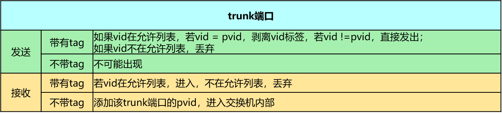
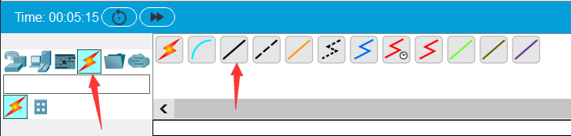
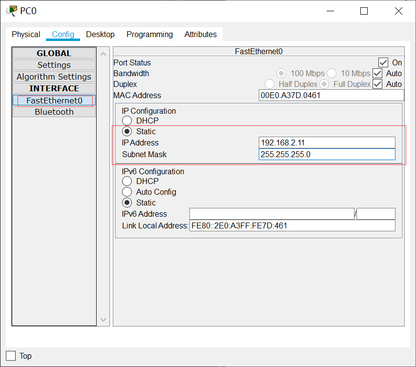
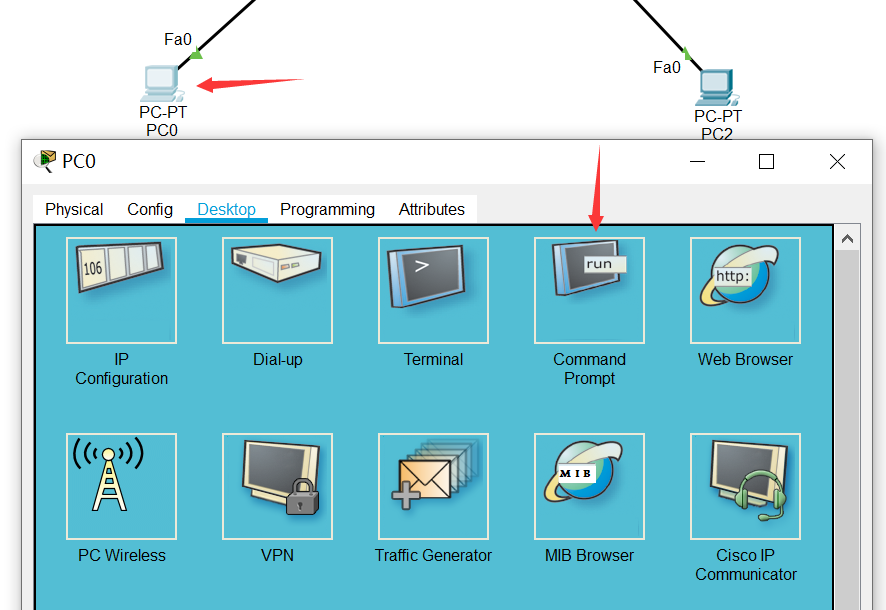
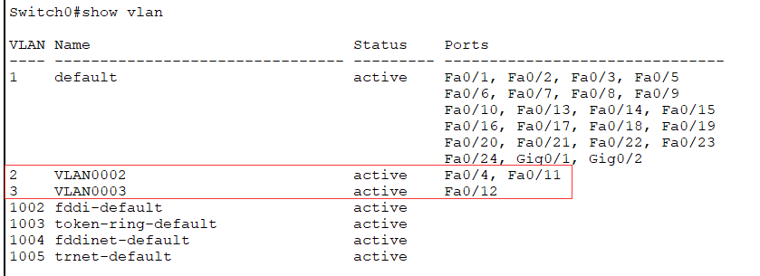

实验目的
=====================

1. 了解VLAN（虚拟局域网）的作用；
2. 掌握跨交换机的VLAN的配置方法；
3. 掌握trunk端口的配置方法；
4. 了解VLAN数据帧的格式、VLAN标记添加和删除的过程。

实验任务
=====================
本实验模拟某公司网络场景。该公司规模较大，内部放置了两台接入交换机（SW2和SW3）负责员工的网络接入，而且在交换机上划分不同VLAN来隔离广播域。由于员工较多，相同部分的员工通过不同交换机接入。为了保证在不同交换机下相同部门的员工能相互通信，需要配置交换机之间的链路为干道（trunk）模式，以实现相同VLAN跨交换机通信。

实验原理
=====================

VLAN概要
~~~~~~~~~~~~~~~~~~~~~~~~~~~~~~
由一台或多台交换机/集线器所组成的1个广播域称为扁平网络（flat network）。相互连接的硬件会接收有网络发来的广播帧。因此，随着连接硬件数量的增加，广播数据也会增加，网络状况也就越发混杂。为了减少广播数据，可以采用将整个扁平网络进行逻辑分段的VLAN（Virtual LAN）技术——一种专门为隔离二层广播报文设计的虚拟局域网技术。在一个VLAN中使用同一个广播域，不同的VLAN用户属于不同的广播域，它不能接收来
自于不同VLAN用户的广播报文，因此可以有效地控制该域内广播通信的规模。

.. image:: VLAN广播域.png

.. hint:: 
   
   网络中将传播过多的广播信息而引起的网络性能恶化的现象称为广播风暴。广播帧属于二层并不会跨越三层，所以为了解决广播风暴，可以使用三层设备隔离广播域，减小广播域范围，比如可以使用路由器来隔离广播域，但由于路由器属于三层设备，对数据的转发容易形成瓶颈，因此一般使用VLAN来隔离广播域。

VLAN帧格式
~~~~~~~~~~~~~~~~~~~~~~~~~~~~~~
当某个VLAN需要跨越多个交换机通信时，一般会使用 **中继端口（trunk port）** 的VLAN标签（tag VLAN）。IEEE 802.1Q标准规定在原有的标准以太网帧格式上增加一个特殊的标志域——tag域，用于表示数据帧所属的VLAN ID，带有VLAN标签的数据包可以通过中继端口完成以太网数据帧的收发。

.. image:: VLAN帧.png

在以太网中，TPID的值为0x8100。如果该值不是0x8100，那么该域则不是表示TPID信息，而是被当作“长度/类型”数据域被识别。

TCI又分为PCP、CFI和VLAN ID三个域。

- PCP（Priority Code Point）：该域占用3个bit位，用于标识数据帧的优先级。
- CFI（Canonical Format Indicator）：该域仅占用1bit 位，如果该位为0，表示该数据帧采用规范帧格式，如果该位为1，表示该数据帧为非规范帧格式。
- VLAN ID：该域占用12个 bit 位，它明确指出该数据帧属于某一个VLAN。0仅用于识别PCP中表示的优先级，4095（0xFFF）为预留值，所以VLAN ID 表示的范围为 1-4094。

.. image:: VLAN转发.png

VLAN端口的分类
~~~~~~~~~~~~~~~~~~~~~~~~~~~~~~
根据端口对 VLAN 数据帧的处理方式，cisco交换机的端口分为 Access port和Trunk port两类。 

Access端口
-------------------------------

Access 端口一般是指那些连接不支持 VLAN 技术的终端设备的端口，这些端口接收到的数据帧都不包含 VLAN 标签，而向外发送数据帧时，必须保证数据帧中也不包含 VLAN 标签。交换机的Access 端口一般接主机或路由器。

**Access端口收报文** ：收到一个报文,判断是否有VLAN标签：如果没有则打上端口的PVID（默认VLAN），并进行交换转发,如果有则直接丢弃（缺省）；

**Access端口发报文** ：将报文的VLAN信息剥离，直接发送出去。

.. image:: access.png

Trunk端口
-------------------------------

Trunk 端口一般是指那些连接支持 VLAN 技术的网络设备（如交换机）的端口，这些端口接收到的数据帧一般都包含 VLAN 标签（数据帧 VLAN ID 和端口缺省 VLAN ID 相同除外），而向外发送数据帧时，必须保证接收端能够区分不同 VLAN 的数据帧，故常常需要添加 VLAN 标签（数据帧 VLAN ID 和端口缺省 VLAN ID 相同除外）。一般用于交换机之间的连接。

**Trunk端口收报文** ：收到一个报文，判断是否有VLAN标签。如果没有则打上端口的PVID（默认VLAN），再进行交换转发；如果有判断该trunk端口是否允许该 VLAN的数据进入，如果可以则转发，否则丢弃；
 
**Trunk端口发报文** ：比较端口的PVID（默认VLAN）和将要发送报文的VLAN标签，如果两者相等则剥离VLAN标签，再发送，如果不相等则直接发送。

.. note:: 
   **以太网交换机带VLAN标签的帧转发说明** 
   
   当交换机某个端口接收到的数据帧，首先，检查该数据帧是否带VLAN标签，如果没有，则将该端口缺省VLAN ID（pvid）作为其VLAN ID，如果带VLAN标签，则检查是否在允许列表里面，若不在则丢弃该数据帧。接下来，交换机结合VLAN ID进行源MAC地址学习，更新MAC地址表。然后，根据该数据帧的目的MAC地址和VLAN ID，查找MAC地址表并向相应端口转发该数据帧。最后，在发送数据帧的端口，需要根据该VLAN ID的类型（Tagged或Untagged ）来决定是否将VLAN标签去掉，然后发送数据帧。
   
   （更多关于VLAN帧转发详见参考文献中的《计算机网络实验教程》以及《奠基·计算机网络（华为微课版）》）

实验环境与分组
=====================

cisco packet tracer模拟器，一人一组。

实验组网
=====================

.. image:: cisco组网图.png

实验步骤
=====================

搭建网络拓扑
~~~~~~~~~~~~~~~~~~~~~~~~~~~~~~~~~

打开Cisco Packet Tracer软件。在底部工具栏区域，选择“Network Devices”，点击“Swithes”，将二层交换机“2960-24TT”拖拽到空白工作区中（需要拖拽两台二层交换机）。

.. image:: conf-1.png
  :scale: 80%

接着，在底部工具栏区域，选择“End Devices”，点击最下一栏的“End Devices”，将计算机设备“PC”拖拽到空白工作区中（需要拖拽4台PC机）。

.. image:: conf-2.png
  :scale: 80%

拖拽完成后如下图所示。

.. image:: conf-3.png
  :scale: 80%

单击“Connections”，选择“Copper Straight-Through(直通线)”并单击。

再单击PC0图标，再弹出的菜单中选择FastEthernet0选项。

.. image:: conf-5.png
  :scale: 80%

再单击二层交换机“2960-24TT” Switch0，再弹出的菜单中选择FastEthernet0/11选项。

.. image:: conf-6.png
  :scale: 80%

这时可以看到计算机PC0已经连接到Switch0上，但看不出是哪两个端口相连。在模拟器主界面的菜单栏上选择Option -> Preferences命令，打开Preferences对话框，在“Interface”选项卡中勾选“Always Show Port Labels in Logical Workspace”复选框即可显示接口名称。

.. image:: conf-7.png
  :scale: 80%

继续用 **Copper Straight-Through(直通线)** 将PC1与Switch0的f0/12连接一起，将PC2和PC3分别与Switch1的f0/13和f0/14连接在一起。

将Switch0和Switch1用 **Copper Cross Over(交叉线)** 进行连接。
        
.. image:: conf-8.png
  :scale: 80%

.. note:: 
  **Copper Straight-Through(直通线)** ：用于连接不同类型的网络设备，如计算机与交换机、交换机与路由器。

  **Copper Cross Over(交叉线)** : 用于连接相同类型的网络设备，如计算机和路由器、路由器和路由器、交换机和交换机、计算机和计算机。

  目前绝大部分网络设备支持MDI/MDIX功能，能够实现线缆自适应，也就是连接时使用直通线或交叉线都可以。但 **在Cisco Packet Tracer中仍要严格遵守连线类型** 。

连接完成的组网图如下图所示。

.. image:: conf-9.png
  :scale: 80%

.. important:: 
  组网图搭建完成后，建议先 **保存** 起来，以免在后续的操作过程中Cisco Packet Tracer模拟器突然挂了：）

进入交换机配置vlan2添加相应接口
~~~~~~~~~~~~~~~~~~~~~~~~~~~~~~~~~
进入Swtich0的用户模式
------------------------------

单击Switch0图标，在弹出的窗口里点击“CLI”选项卡，在“IOS Command Line Interface”工作区中敲回车键，进入交换机的用户模式

.. image:: conf-10.png
  :scale: 80%

配置Switch0的VLAN 2
------------------------------
在Switch0交换机上使用下列命令进行VLAN配置：

.. code-block:: sh
   :linenos:

   Switch>enable   //进入交换机特权模式
   Switch#configure terminal  // 进入交换机全局模式（也称为config模式）
   Enter configuration commands, one per line.  End with CNTL/Z.
   Switch(config)#  // 全局模式的提示符是“(config)#”
   Switch(config)# hostname Switch0 // 更改交换机的主机名

   Switch0(config)#vlan 2  // 创建vlan 2
   Switch0(config-vlan)#exit 

   Switch0(config)#interface f0/11 // 进入f0/11接口模式
   Switch0(config-if)#switchport access vlan 2 //将f0/11端口划分给vlan 2
   Switch0(config-if)#exit

   Switch0(config)#interface f0/4  // 进入f0/4接口模式
   Switch0(config-if)#switchport access vlan 2 //将f0/4端口划分给vlan 2
   Switch0(config-if)#exit
   Switch0(config)#exit
   Switch0#

观察配置Switch0的VLAN信息
------------------------------
在Switch0上查看划分的vlan信息：

.. image:: conf-11.png
  :scale: 80%

配置Switch1的VLAN 2
------------------------------
在Switch1交换机上使用下列命令进行VLAN配置：

.. code-block:: sh
   :linenos:

   Switch>enable   //进入系统视图
   Switch#configure terminal
   Enter configuration commands, one per line.  End with CNTL/Z.
   Switch(config)#
   Switch(config)# hostname Switch1 // 更改交换机的主机名

   Switch1(config)#vlan 2  //创建vlan 2
   Switch1(config-vlan)#exit

   Switch1(config)#interface f0/13
   Switch1(config-if)#switchport access vlan 2 //将f0/13端口划分给vlan 2
   Switch1(config-if)#exit

   Switch1(config)#interface f0/4  
   Switch1(config-if)#switchport access vlan 2 //将f0/4端口划分给vlan 2
   Switch1(config-if)#exit
   Switch1(config)#exit
   Switch1#

观察Switch1的VLAN信息
------------------------------
在Switch1上查看划分的vlan信息：

.. image:: conf-14.png
  :scale: 80%
   

设置计算机的IP地址
------------------------------
为PC0~PC3配置IP地址，如下表所示。

========= ====================  ===================
设备       IP地址                子网掩码
========= ====================  ===================
PC0       192.168.2.11          255.255.255.0
PC1       192.168.3.12          255.255.255.0
PC2       192.168.2.13          255.255.255.0
PC3       192.168.3.14          255.255.255.0
========= ====================  ===================

单击PC0图标，在Config选项卡中，选择“FastEthernet0”，设置该端口的IP地址，如下图所示。

可参照PC0的配置方式来配置PC1、PC2和PC3的IP地址。

观察同一VLAN和不同VLAN的连通情况
------------------------------

单击PC0，在Desktop选项卡中，单击“Command Prompt”选项，则可进入命令行模式。

.. tip:: 
  **实验测试**

  PC0和PC2属于同一VLAN，用PC0 ping PC2的IP地址192.168.2.13，看看是否相通？

  PC1和PC3没有配置VLAN，用PC1 ping PC3的IP地址192.168.3.14，看看是否相通？

.. image:: conf-17.png
  :scale: 80%

进入交换机配置vlan3接口ip并观察连通性
~~~~~~~~~~~~~~~~~~~~~~~~~~~~~~~~~~~~~~~~~~~~~

配置Switch0的VLAN 3
------------------------------
在Switch0交换机上的系统视图下使用下列命令进行配置：

.. code-block:: sh
   :linenos:

   Switch0>enable 
   Switch0#configure terminal  
   Enter configuration commands, one per line.  End with CNTL/Z.
   Switch0(config)#
   Switch0(config)#vlan 3  //创建vlan 3
   Switch0(config-vlan)#exit
   Switch0(config)#

   Switch0(config)#interface f0/12
   Switch0(config-if)#switchport access vlan 3 //将f0/12端口划分给vlan 3
   Switch0(config-if)#exit
   Switch0(config)#exit
   Switch0#

观察Switch0的VLAN信息
------------------------------

在Switch0上使用“show vlan”命令查看VLAN的信息。

配置Switch1的VLAN 3
------------------------------
在Switch1交换机上的系统视图下使用下列命令进行配置：

.. code-block:: sh
   :linenos:

   Switch1>enable 
   Switch1#configure terminal  
   Enter configuration comm ands, one per line.  End with CNTL/Z.
   Switch1(config)# 
   Switch1(config)#vlan 3  //创建vlan 3
   Switch1(config-vlan)#exit
   Switch1(config)#

   Switch1(config)#interface f0/14
   Switch1(config-if)#switchport access vlan 3 //将f0/14端口划分给vlan 3
   Switch1(config-if)#exit
   Switch1(config)#exit
   Switch1#

观察Switch1的VLAN信息
------------------------------

在Switch1上使用“show vlan”命令查看VLAN的信息。

.. image:: conf-19.png
  :scale: 80%

观察同一VLAN 3的连通情况
------------------------------
验证测试：在PC1上ping PC3验证连通性，还是没有ping通。

.. note:: 由于VLAN技术的隔离，网络设备都处于不连通状态。

.. image:: conf-20.png
  :scale: 80%

配置接口trunk模式并验证连通性
~~~~~~~~~~~~~~~~~~~~~~~~~~~~~~~~~~~~~~~~~~~~~

配置Switch0和Switch1的trunk端口
----------------------------------------
将Switch0与Switch1的g0/0/4接口模式配置为trunk，使得所有VLAN都可以通过。
在Switch0交换机下使用下列命令进行配置：

.. code-block:: sh
   :linenos:

   Switch0(config)#interface f0/4 //进入g0/0/4接口
   Switch0(config-if)#switchport mode trunk //把端口的连接类型设置为trunk模式
   Switch0(config-if)#exit
   Switch0(config)#exit
   Switch0#

使用show running-config命令查看配置命令

.. image:: conf-21.png
  :scale: 80%

在SW1交换机下使用下列命令进行配置：

.. code-block:: sh
   :linenos:

   Switch1(config)#interface f0/4 //进入g0/0/4接口
   Switch1(config-if)#switchport mode trunk //把端口的连接类型设置为trunk模式
   Switch1(config-if)#exit
   Switch1(config)#exit
   Switch1#

使用show running-config命令查看配置命令

.. image:: conf-22.png
  :scale: 80%

观察VLAN 3的连通情况
------------------------------
在PC1上使用ping PC3命令测试连通性，如图：

.. image:: conf-23.png
  :scale: 80%

观察同一VLAN和不同VLAN的连通情况
------------------------------------------
在PC0上使用ping PC2命令测试连通性，在PC0上使用ping PC3命令测试连通性，如图:

.. image:: conf-24.png
  :scale: 80%

完成trunk模式配置后，PC0和PC2互通，PC1和PC3互通，PC0和PC3不连通。

.. hint:: 
  **调试和排错**

  1. 检查交换机与交换机之间的端口是否配置为Trunk模式。
  2. 检查各端口华为的VLAN是否正确。
  3. 一般来说，交换机等设备都具有自适应性，即支持直通线和交叉线混用，但在使用Cisco Packet Tracer模拟器软件时，要注意直通线和交叉线的区别，二者不能混用。

  

.. important:: 
  **思考题** 

  下图中Switch0的Fa0/1和Fa0/4属于同一个VLAN 2，Switch1的Fa0/1和Fa0/4属于同一个VLAN 3，试验结果PC0和PC1能互通，在不同VLAN为什么也能通？把Switch0的Fa0/4和Switch1的Fa0/4改成trunk模式反而不通。请分析其原因。

  .. image:: conf-26.png

