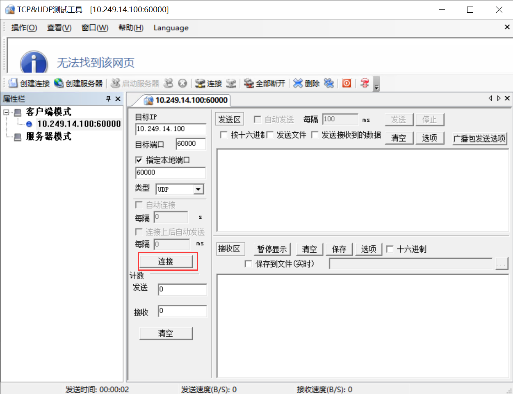

实 验目的
=====================

1. 熟悉UDP数据包格式；
2. 掌握UDP校验和的计算方法；
3. 掌握UDP数据包的的发送和接收处理过程。

实验任务
=====================
在完成Lab5协议栈之ICMP协议的基础上，编写UDP报文的发送、接收函数，使其能够发送和接收IUDP数据报文，并且能通过实验评测系统的测试。

实验原理
=====================

UDP协议概要
~~~~~~~~~~~~~~~~~~~~~~~~~~~~~~

TCP和UDP是TCP/IP中两个具有代表性的传输层协议。TCP提供可靠的通信传输，UDP是不具有可靠性的数据报协议。可能有人会认为，TCP一定优于UDP。其实不然，TCP与UDP的优缺点无法简单地、绝对地去做比较。UDP主要用于那些对高速传输和实时性有较高要求的通信或广播通信。例如，使用IP电话进行通话时，如果使用TCP，数据在传输过程若丢失会被重发，这样就无法流畅地传输通话人的声音，无法正常交流。然而UDP不会重发，也就不会有声音大幅度延迟到达的问题，即使有部分数据丢失，也只是会导致画面或声音的短暂停顿甚至出现混乱，但相比之下这一点干扰并无大碍。

.. image:: UDP格式.png

UDP头部
~~~~~~~~~~~~~~~~~~~~~~~~~~~~~~

.. image:: UDP头部.png

从前面的实验可知，数据链路层的地址（MAC地址）通过“类型”字段来区分上一层所采用的哪一种网络协议（IP、ARP等）。网络层IP首部也有一个“协议”字段来标识上一层采用哪一种传输层协议。同样地，传输层（TCP、UDP）也有类功能的字段—— **端口号** ，用于识别自己所传输的数据部分究竟应该发给哪个应用程序，因此，它也被称为程序地址。

.. note::
    **端口号范围划分**

    0~1023：知名端口号，如http 80，FTP 20/21，Telnet 23，SMTP 25，DNS 53等。1024~49151：注册端口号。关于知名端口号和注册端口号，请参考以下网址：http://www.iana.org/assignments/port-numbers。

    49152~65535：动态或私有端口号。客户端应用程序的端口号可由操作系统动态分配，服务端一般要自设定端口号。

**长度** 字段是UDP头部和UDP数据报的总长度，以字节为单位。

**校验和** 字段是为了提供可靠的UDP首部和数据而设计的。

UDP校验和计算方法
~~~~~~~~~~~~~~~~~~~~~~~~~~~~~~

UDP校验和的覆盖范围与IP首部校验和的覆盖范围是不一样的。UDP校验和需要覆盖UDP头部、UDP数据和一个伪头部。伪头部是在UDP头部之前添加了12字节的头部信息，其中，源IP地址、目的IP地址和协议号来源于IPv4的头部，UDP长度是UDP包的总长度。此外，如果“数据”字段不是偶数个字长时，它会被填充一个值为0的字节以计算校验和。当然，伪头部和任何填充的数据不会与UDP数据报一起被传送出去。

.. image:: UDP伪头部.png

.. note:: 
    如果UDP头部的校验和字段填入0，可以不进行校验和计算，降低协议处理的开销，从而可以提高数据转发的速度。然而，如果UDP首部的端口号或是IP首部的IP地址遇到损坏，那么可能会对其他通信造成不好的影响。因此，建议使用校验和检查。

.. hint:: 
    **为什么要使用UDP伪头部计算校验和？**

    在TCP/IP通信中，仅凭目标端口识别某一个通信是远远不够的，通常采用5个信息（也称五元组）来识别一个通信，分别是　**源IP地址**　、　**目标IP地址**　、　**协议号**　（IP首部中的协议字段）、　**源端口号**　、　**目标端口号**　。它们能够区分不同通信，只要有一项遇到损坏，就有可能导致应该收包的应用程序收不到包，不该收到包的应用程序却收到了包。为了避免这些问题，在校验和的计算中引入了伪头部的概念。

代码实现与检测
=====================

请同学们认真阅读本实验提供的代码框架，并补充完整src/udp.c文件中的udp_in()函数、udp_out()函数以及udp_checksum()函数。

UDP数据报输出处理
~~~~~~~~~~~~~~~~~~~~~~~~~~~~~~~~~~~~

同学们需要自行实现udp_out()函数，功能如下：

**Step1** ：首先调用buf_add_header()函数添加UDP报头。

**Step2** ：接着，填充UDP首部字段。

**Step3** ：先将校验和字段填充0，然后调用udp_checksum()函数计算出校验和，再将计算出来的校验和结果填入校验和字段。

**Step4** ：调用ip_out()函数发送UDP数据报。

UDP数据报输入处理
~~~~~~~~~~~~~~~~~~~~~~~~~~~~~~~~~~~~

同学们需要自行实现udp_in()函数，功能如下：

**Step1** ：首先做包检查，检测该数据报的长度是否小于UDP首部长度，或者接收到的包长度小于UDP首部长度字段给出的长度，如果是，则丢弃不处理。

**Step2** ：接着重新计算校验和，先把首部的校验和字段保存起来，然后把该字段填充0，调用udp_checksum()函数计算出校验和，如果该值与接收到的UDP数据报的校验和不一致，则丢弃不处理。

**Step3** ：调用map_get()函数查询udp_table是否有该目的端口号对应的处理函数（回调函数）。

**Step4** ：如果没有找到，则调用buf_add_header()函数增加IPv4数据报头部，再调用icmp_unreachable()函数发送一个端口不可达的ICMP差错报文。

**Step5** ：如果能找到，则去掉UDP报头，调用处理函数来做相应处理。

UDP校验和
~~~~~~~~~~~~~~~~~~~~~~~~~~~~~~~~~~~~

同学们需要自行实现udp_checksum()函数，功能如下：

**Step1** ：首先调用buf_add_header()函数增加UDP伪头部。

**Step2** ：将IP头部拷贝出来，暂存IP头部，以免被覆盖。

**Step3** ：填写UDP伪头部的12字节字段。

**Step4** ：计算UDP校验和。

**Step5** ：再将 **Step2** 中暂存的IP头部拷贝回来。

**Step6** ：调用buf_remove_header()函数去掉UDP伪头部。

**Step7** ：返回计算出来的校验和值。

实验自测
~~~~~~~~~~~~~~~~~~~~~~~~~~~~~~

UDP自测需要通过main测试。

.. image:: cmake.png
    :scale: 60%

接着，选择“在终端中运行”

.. image:: cmake1.png
    :scale: 60%

.. image:: cmake2.png

打开 wireshark，选择物理机的真实网卡作为抓包对象，并设置过滤条件为：

eth.addr == XX.XX.XX.XX 

XX.XX.XX.XX 是你自己的虚拟网卡MAC地址

.. image:: cmake3.png

打开TCP&UDPDebug调试工具，点击“创建连接”，类型选择“UDP”，目标 IP：10.249.14.100，目标端口号：60000，本机端口号指定：60000。设置完成，点击创建。

.. image:: cmake4.png

点击连接

在TCP&UDPDebug调试工具的发送窗口输入“abc”测试字符串，点击发送。此时UDP调试工具能够接收到虚拟网卡回送的数据包。如下图所示。

.. image:: cmake6.png

在终端上也能看见main的运行结构

.. image:: cmake7.png

此时，Wireshark上也有数据包的交互。

.. image:: cmake8.png

.. attention::

    请分析你自己用Wireshark抓包工具捕获到的相关报文（包含UDP和ARP报文），解析报文内容，并写到本次实验的实验报告中。

实验提交
=====================

请参考实验一的提交方式。