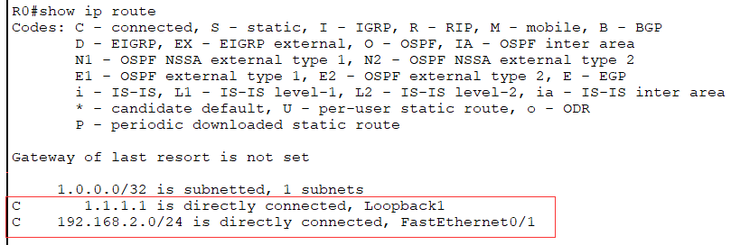
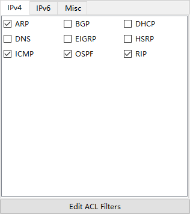
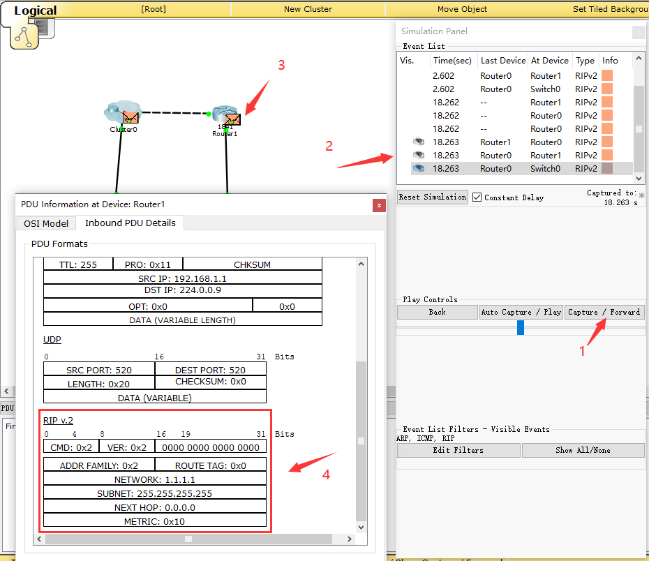
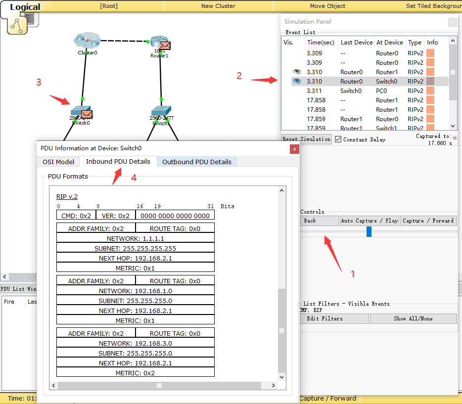
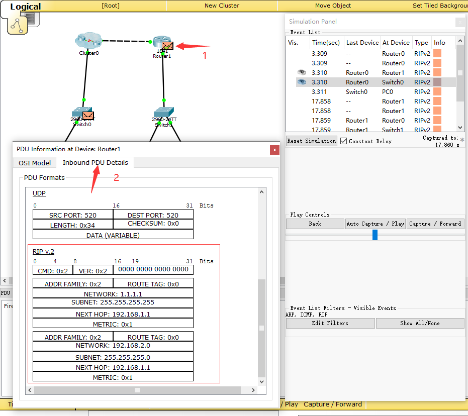

实验目的
=====================

1. 了解动态路由协议的原理与应用。
2. 熟悉RIP协议的特点，理解水平分割、触发更新和毒性逆转的作用。
3. 掌握RIP协议的配置方法。

实验任务
=====================
掌握RIP的配置方法，在cisc packet tracer上截取RIP报文，理解触发更新和水平分割对RIP收敛速度和避免环路的作用。

实验原理
=====================

RIP概要
~~~~~~~~~~~~~~~~~~~~~~~~~~~~~~

RIP（Routing Information Protocol）是基于距离矢量算法的一种路由协议，它使用“跳数”，即指所经过的路由器的个数来衡量到达目标地址的路由距离，广泛应用于LAN。BSD UNIX系统的routed进程采用了RIP协议，由此RIP得到了迅速的普及。

RIP协议特点
~~~~~~~~~~~~~~~~~~~~~~~~~~~~~~
RIP协议特点可归纳如下：

1. 30秒一次，将自己所知道的路由信息广播出去。如果一个路由在180秒内未被刷，就认为网络被断开。
2. 根据距离向量生成路由控制表。路由控制表针对同一个网络如果有两条路径，那么选择距离较短的一个。如果距离相等，通常是随机选择一个或是轮换使用。

但是，这两个特点使得RIP明显存在一些问题。如下图所示，当网络A存在通信故障时，路由器A虽然认为自己与网络A的连接已经断开了，但是它还会收到路由器B曾经获知的路由消息，这就会让路由器A误认为还可以通过路由器B到达网络A。这样就会导致无限计数（Counting to Infinity），出现路由环路。

.. image:: RIP1.png

.. image:: RIP2.png

.. image:: RIP3.png

为了解决这个问题，RIP采取以下两种方法：

1. 最长跳数不超过16（16被定义成无穷大，即目标网络或主机不可达）。这个信息只保留120秒。一旦超过这个时间，信息将被删除。
2. 采用 **水平分割** （Split Horizon）方法，即路由器不在把所收到的路由信息原路返回给发送端。

然而，在环路有多余的情况下，需要很长时间才能产生正确的路由信息。在有些情况下（比如帧中继Hub-spoke网络结构、X.25等非广播多路访问网络）需要关闭水平分割，否则将无法正常传递路由信息。

为了尽可能解决这个问题，RIP又提供了触发更新（Triggered Update）、毒性逆转（Posion Reverse）和保持定时器法机制。

**触发更新** 是指当网络发生变化时，路由器就立即发送其新的路由表，而不是等待30秒。

**毒性逆转** 是水平分割的一种变型。当网络发送故障时，它不是不再发送这个消息，而是发送一个距离为16的消息。

**保持定时器法** 是设置路由信息被抑制的时间，默认为180s。当路由条目不可达的时候，抑制时间内不会接受该路由条目的更新；除非从该路由条目的发送方接受到了更优的路由条目，或者保持计时器到期为止。

.. hint::
  
  通过上述方法，RIP的最大网络范围在16跳以内，而且路由器想要达到一个稳定的状态也需要花一段时间。如果想要明确地掌握网络结构，可以采用路由协议相对复杂的OSPF（Open Short Path First）路由协议，在本实验中不做重点介绍。

RIP报文格式
~~~~~~~~~~~~~~~~~~~~~~~~~~~~~~
RIP协议使用UDP协议的520端口来发送和接收RIP报文。RIP协议有两个版本：RIPv1和RIPv2。RIPv2是RIPv1的加强版，与RIPv1相比，功能上明显增强，也提高了对错误的抵抗能力。RIPv1的response报文是广播报文，目的地址是255.255.255.255。为了减轻那些不接收RIP协议数据包的主机的不必要负载，RIPv2采用组播地址224.0.0.9进行周期性地广播。

以下为RIPv2的报文格式，如下图所示。

.. image:: RIP格式.png

(1)	命令字(Command)：1为请求报文，2为应答报文。

(2)	版本 (Version)：指生成RIP报文时所使用的版本，RIP只有两个版本:版本1和版本2。

(3)	路由选择域 (Routing Domain)：路由域标号为0的是缺省的路由域。

(4)	地址族标识（Address Family Identifier）：报文中所携带地址的类型，提供了和以前版本的兼容性。IP协议簇对应的值为2，该字段使RIP可以用于多种不同的协议簇。

(5)	路由标记(Route Tag)  ：用于传递自治系统的标号。

(6)	IP地址(IP Address)：可以是主机、网格，甚至是一个缺省网关地址。

(7)	子网掩码(Subnet Mask)：子网掩码信息是RIP协议在多种环境中变得更有用，并且允许在网络中使用变长掩码。

(8)	下一跳地址(Next Hop)：支持下一跳地址优化了在使用多种路由协议的网络环境中的路由器。

(9)	度量值（Metric）：这个值经过路由器时被递增。数量标准有效的范围是在1～15之间。

实验环境与分组
=====================

cisco packet tracer模拟器，一人一组。

实验组网
=====================

.. image:: cisco-1.png

.. note:: 
  Loopback是一种纯软件性质的虚拟接口，Loopback接口一旦被创建，将一直保持UP状态，直到被删除。路由器和三层交换机都可以配置Loopback接口。任何送到该接口的网络数据报文都会被认为是送往路由器自身的。

IP地址表：

==============     =========================
设备名称    	        IP地址    
==============     =========================
R0-f0/1              192.168.2.1/24  
R0-f0/0			         192.168.1.1/24  
R1-f0/1   	 	 	     192.168.3.1/24  
R1-f0/0     	       192.168.1.2/24  
R1-loopback 1		     1.1.1.1/32  
==============     =========================

实验步骤
=====================

搭建网络拓扑
~~~~~~~~~~~~~~~~~~~~~~~~~~~~~~~~~
打开Cisco Packet Tracer软件绘制出组网图。

路由器型号：1841

交换机型号：2960

.. note:: 
  路由器和路由器之间的连接线需要使用Copper Cross Over(交叉线)。交换机和路由器、交换机和计算机使用Copper Straight-Through(直通线)。

  搭建完网络拓扑图后，记得保存好！

配置三台PC的IP地址
~~~~~~~~~~~~~~~~~~~~~~~~~~~~~~

按照下表设置PC0、PC1和PC2这三台电脑的IP地址。

========    =====================
计算机       IP地址  
========    =====================
PC0     	  192.168.2.11/24	
PC1		      192.168.3.13/24	  
PC2		      192.168.3.14/24
========    =====================

配置路由器、交换机基本信息和计算机的网关
~~~~~~~~~~~~~~~~~~~~~~~~~~~~~~~~~~~~~~~~~~~~~~~~~~~~~~~~~~~~

.. _loopback:

在路由器R0上配置端口的IP地址
------------------------------------------
路由器在第一次配置时会启动配置向导界面，通常选择no，不进入对话模式，而是直接进入正常配置模式。

.. image:: cisco-2.png
  :scale: 80%

配置R0的基本信息。

.. code-block:: sh
   :linenos:

   Router>enable 
   Router#configure terminal 
   Router(config)#hostname R0 // 重命名为R0
   Router(config)#no ip domain-lookup  // 用于防止DNS解析的命令。如果没有这条命令，当你输入错误的命令时，cisco会尝试连接DNS服务器进行域名解析，浪费时间。     

   R0(config)#interface f0/0  // 打开f0/0接口（默认接口关闭）
   R0(config-if)#ip address 192.168.1.1 255.255.255.0 //配置f0/0接口ip地址
   R0(config-if)#no shutdown // 打开f0/0接口
   R0(config-if)#exit

   R0(config)#interface f0/1  // 进入f0/1接口模式
   R0(config-if)#ip address 192.168.2.1 255.255.255.0 //配置f0/1接口ip地址
   R0(config-if)#no shutdown  // 打开f0/1接口（默认接口关闭）
   R0(config-if)#exit
   
   R0(config)#interface loopback 1  //配置Loopback回环接口
   R0(config-if)#ip address 1.1.1.1 255.255.255.255 //配置回环地址
   R0(config-if)#exit
   R0(config)#exit

查看R0路由表
------------------------------

在路由器R1上配置端口的IP地址
------------------------------------
配置R1的基本信息

.. code-block:: sh
   :linenos:

   Router>enable
   Router#configure terminal 
   Router(config)#hostname R1 // 重命名为R1
   Router(config)#no ip domain-lookup  // 用于防止DNS解析的命令。

   R1(config)#interface f0/0  // 进入f0/0接口模式
   R1(config-if)#ip address 192.168.1.2 255.255.255.0 //配置f0/0接口ip地址
   R1(config-if)#no shutdown  // 打开f0/0接口
   R1(config-if)#exit
  
   R1(config)#interface f0/1  // 进入f0/1接口模式
   R1(config-if)#ip address 192.168.3.1 255.255.255.0 //配置f0/1接口ip地址
   R1(config-if)#no shutdown  // 打开f0/1接口
   R1(config-if)#exit
   R1(config)#exit
   R1#

查看R1路由表，并观察R0和R1的连通性
------------------------------------------

.. image:: cisco-4.png
  :scale: 80%

R1配置完成后，R0和R1已经连通。此时，再次查看R0路由表，已经可以看到有192.168.1.0/24网段了。

.. image:: cisco-5.png
  :scale: 80%

配置三台计算机的网关
------------------------------

PC0网关为192.168.2.1

.. image:: cisco-6.png
  :scale: 80%

PC1和PC2网关为192.168.3.1，配置方法和PC0一样。

PC0通过默认网关将发往未知网络的数据交由R0处理。同理PC1和PC2通过默认网关将数据交给R1。

在R0上ping R1验证连通性
----------------------------------

.. image:: cisco-7.png
  :scale: 80%

在PC0上ping R0验证连通性
----------------------------------

.. image:: cisco-8.png
  :scale: 80%

在PC1上ping R1验证连通性
----------------------------------

.. image:: cisco-9.png
  :scale: 80%

在PC0上ping PC1验证连通性
--------------------------------------

.. image:: cisco-10.png
  :scale: 80%

此时，还没有设置RIP路由协议，PC0和PC1还不能相互连通。

.. attention:: 在启动RIP协议前，在R0上ping各台计算机，看是否能够ping通？通过在R0上查看路由表，分析其原因？
   
   *（请把答案写到实验报告中）* 

配置RIP协议及查看路由表，并测试连通性
~~~~~~~~~~~~~~~~~~~~~~~~~~~~~~~~~~~~~~~~~~~~~~~~~~~~~~~~~~~~

为两台路由器配置RIP协议，并通告其网络。具体命令如下：

在路由器R0上启用RIP协议
------------------------------
在R0的全局模式下配置：

.. code-block:: sh
   :linenos:

   R0(config)#router rip  //启用RIP协议
   R0(config-router)#version 2 // 设置版本号为RIP v2

   R0(config-router)#network 192.168.1.0  //通告直连网段，在网段192.168.1.0上启动RIP
   R0(config-router)#network 192.168.2.0  //通告直连网段，在网段192.168.2.0上启动RIP
   R0(config-router)#network 1.0.0.0  //通告直连网段，在网段1.0.0.0上启动RIP
   R0(config-router)#no auto-summary  //关闭自动汇总功能
   R0(config-router)#exit
   R0(config)#exit

路由器R1上启用RIP协议
------------------------------
在R2全局模式下配置：

.. code-block:: sh
   :linenos:

   R1(config)#router rip  //启用RIP协议
   R1(config-router)#version 2  // 设置版本号为RIP v2

   R1(config-router)#network 192.168.1.0  //通告直连网段，在网段192.168.1.0上启动RIP
   R1(config-router)#network 192.168.3.0  //通告直连网段，在网段192.168.3.0上启动RIP
   R1(config-router)#no auto-summary  //关闭自动汇总功能
   R1(config-router)#exit
   R1(config)#exit
   R1#

查看R0和R1的路由表
------------------------------
R0路由表:

.. image:: cisco-12.png
  :scale: 80%

此时，R0上多了一条RIP路由信息，即要达到192.168.3.0/24网段，下一个转发端口是192.168.1.2。

R1路由表:

.. image:: cisco-11.png
  :scale: 80%

此时，R1上多了两条RIP路由信息。

测试PC0到PC1之间的连通性
---------------------------------------------

.. image:: cisco-13.png
  :scale: 80%

配置RIP路由协议后，PC0能访问到PC1了。

.. attention:: 在配置RIP协议后，比较和配置RIP协议前中R0路由表的差异；测试R0和各台计算机是否能够通信，并说明原因。
   
   *（请把答案写到实验报告中）*

触发更新和水平分割
~~~~~~~~~~~~~~~~~~~~~~~~~~~~~~~~~~~~~~~~~~~~~~~~~~~~~~~~~~~~

进入仿真调试模式
------------------------------

在Cisco Packet Tracer软件右下角有“Simulation”按钮，点击该按钮就进入了仿真模式。

.. image:: cisco-stu-1.png
  :scale: 100%

在“Event List Filters-Visible Events”窗口栏中显示捕获的协议，这里面有很多是我们不需要观察的协议。单击Show All/None，也就是不显示任何协议。然后，再单击Edit Filters。在弹出的窗口里，选择IPv4选项卡，选择ARP、ICMP、RIP这三种协议，本实验只需观察这三种协议即可。

单击“Auto Capture / Play”按钮，让网络设备开始运行。此时，我们可以观察数据包的传输过程。包转发需要一些时间，请耐心等待。

.. image:: cisco-stu-2.png
  :scale: 100%

.. image:: cisco-stu-3.png

上图中，在8.440时刻，从Router0发出来了两个RIP数据包。点击“forward”前向三角按钮，在8.441s，这两个数据包分别被传输到Switch0和Router1。再次点击“forward”前向三角按钮，数据包在8.442s到达PC0，而之前到达Router1的数据没有在此时转发出来。这是因为Router1收到RIP协议数据包后，需要更新自身的路由表，然后等到它的下一个发包时刻再转发出路由数据包。13.078s，此时轮到Router1对外转发它的路由信息。13.079s数据包分别到达Router0和Switch1。由此我们可以观察数据包的传输过程。

在上图中，我们可以看到Router0第一次发出RIP数据包是在8.440s，第二次发送RIP数据包是在37.666s，第三次是在66.796s，相差间隔差不多是30s，这也验证了RIP是每30s将自己所知道的路由信息广播出去。

观察触发更新报文
------------------------------

单击“Auto Capture / Play”键停止抓包，然后单击“Reset Simulation”清空抓包信息。

再按下“Play”键开始抓包。然后在Router0上使用命令no interface loopback1断开回环地址loopback 1，此时Simultaion Panel面板上显示结果如下:

.. image:: cisco-stu-4.png

图中，2.601s，Router0发出两个RIP数据包。当我们输入`no interface loopback 1`命令断开loopback 1时，在18.262s，Router0又发出两个RIP数据包。此时，距离上一个Router0发出数据的时间还没有到达30s。

单击“Back”按钮，选择到18.262s行的Router0，再点击Router0上的“信封”按钮，在弹出窗口的Outbound PDU Details选项卡中，可以看到这个RIP数据包携带有达到1.1.1.1网络的跳数为16，也就是不可达。

.. image:: cisco-stu-5.png
  :scale: 100%

单击“Capture / Forward”按钮，18.263s，该RIP包到达Router1后，Router1也立刻转发该路由信息。也就是，一条路有切断，全网通告。

由此可知，在网络发生改变时，RIP路由协议会及时触发更新，而不是等到下一个30s后才发出路由信息。

.. attention:: 观察你所截获的RIP响应报文（任选一条响应报文），并填写实验报告。
   
   *（请把答案写到实验报告中）*

观察取消水平分割前后报文差异
---------------------------------------

参照上述配置方式 :ref:`loopback`，重新配置好loopback 1。

单击“Play”键停止抓包，然后单击“Reset Simulation”清空抓包信息。再按下“Play”键开始抓包。接下来，我们观察打开/关闭水平分割的报文。

单击“Back”按钮，选择到3.310s行，我们找到从Router0发出到Switch0的RIP数据包。以下图为例，在3.310s，Switch0收到的RIP路由信息有两条，显示到达192.168.1.0网段需要1跳，到达192.168.3.0网段需要2跳。

同样在3.310s，Router1也收到Router0的RIP数据包，在该数据包中，只有到达1.1.1.1网段和192.168.2.0的路由信息，没有192.168.1.0网段和192.168.3.0网段的路由信息。这是因为开启了水平分割（rip配置后默认启动水平分割），Router0是从F0/0端口接收学习到192.168.1.0网段和192.168.3.0网段的路由信息，就不会再从该接口发回去。

接着，取消Router0的水平分割，我们继续观察RIP数据包。

.. code-block:: sh
   :linenos:
   
   R0(config)#interface f0/0
   R0(config-if)#no ip split-horizon 

.. image:: cisco-stu-9.png

如上图所示，在取消水平分割后，Router1收到Router0的4条路由协议，多了2条来自192.168.1.0和192.168.3.0的报文。

.. attention:: 比较水平分割前后R0发给R1的RIP报文路由信息的不同，并填写实验报告。
   
   *（请把答案写到实验报告中）*

实验提交
=====================
请参考实验一的提交方式。