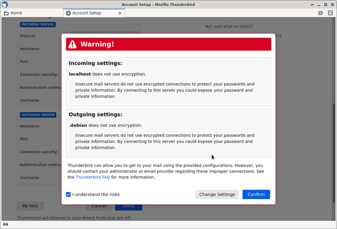

实验目的
=====================

1. 熟悉并掌握Socket网络编程；
2. 掌握SMTP和POP3协议。

实验任务
=====================
本实验中有两个任务。

第一个任务是编写一个简单的邮件发送客户端，将邮件发送给任意收件人。客户端需要连接到邮件发送服务器，使用SMTP协议进行交互。发送邮件已有许多现成库，但本次实验中不允许使用第三方库直接发送邮件，因为它隐藏了邮件发送客户端与邮件发送服务器的交互细节。

第二个任务是编写一个简单的邮件接收客户端，获取你接收到的邮件。客户端需要连接到邮件接收服务器，使用POP3协议进行交互。同样，交互细节需自行编程处理，不可直接调用第三方库接收邮件。

实验原理
=====================

电子邮件的发送和接受过程
~~~~~~~~~~~~~~~~~~~~~~~~~~~~~~

这里先给出用户A从QQ邮箱发送邮件到用户B 163邮箱的图示，然后对图示的过程进行详细的介绍：

.. image:: 邮件.png

图示的六个步骤分别进行如下的说明：

(1) 用户A的电子邮箱为：xx@qq.com，通过邮件客户端软件写好一封邮件，交到QQ的邮件服务器，这一步使用的协议是SMTP,对应图示的(1)；

(2) QQ邮箱会根据用户A发送的邮件进行解析，也就是根据收件地址判断是否是自己管辖的账户，如果收件地址也是QQ邮箱，那么会直接存放到自己的存储空间。这里我们假设收件地址不是QQ邮箱，而是163邮箱，那么QQ邮箱就会将邮件转发到163邮箱服务器，转发使用的协议也是SMTP，对应图示的(2)；

(3) 163邮箱服务器接收到QQ邮箱转发过来的邮件，也会判断收件地址是否是自己，发现是自己的账户，那么就会将QQ邮箱转发过来的邮件存放到自己的内部存储空间，对应图示的(3)；

(4) 用户A将邮件发送了之后，就会通知用户B去指定的邮箱收取邮件。用户B会通过邮件客户端软件先向163邮箱服务器请求，要求收取自己的邮件，对应图示的(4)；

(5) 163邮箱服务器收到用户B的请求后，会从自己的存储空间中取出B未收取的邮件，对应图示(5)；

(6) 163邮箱服务器取出用户B未收取的邮件后，将邮件发给用户B，对应图示的(6)；最后三步用户B收取邮件的过程，使用的协议是POP3;

SMTP协议工作机制
~~~~~~~~~~~~~~~~~~~~~~~~~~~~~~
SMTP（Simple Mail Transfer Protocol，简单邮件传输协议）定义了邮件客户端与SMTP服务器之间，以及两台SMTP服务器之间发送邮件的通信规则。SMTP协议属于TCP/IP 协议族，通信双方采用一问一答的命令/响应形式进行对话，且有一定的对话的规则和所有命令/响应的语法格式。

SMTP协议分为标准SMTP协议和扩展SMTP 协议，标准SMTP协议是1982年在RFC 821文档中定义的，而扩展SMTP协议是1995年在RFC 1869文档中定义的。扩展SMTP协议在标准SMTP协议基础上的改动非常小，主要增加了邮件安全方面的认证功能，现在我们说的SMTP 协议基本上都是扩展SMTP协议。

RFC 1869文档链接：https://www.rfc-editor.org/rfc/rfc1869.html。

SMTP 协议中一共定义了18条命令，但是发送一封电子邮件的过程通常只需要6条命令，这6条命令/响应的语法格式总结如下：

=================================   ==================================
SMTP命令格式	                      说明
=================================   ==================================
EHLO <domain><CR><LF>	              EHLO命令是SMTP邮件发送程序与SMTP邮件接收程序建立连接后必须发送的第一条SMTP命令，参数<domain>表示 SMTP邮件发送者的主机名。EHLO命令用于替代传统SMTP协议中的HELO命令。
AUTH <para><CR><LF>	                如果SMTP邮件接收程序需要SMTP邮件发送程序进行认证时，它会向SMTP邮件发送程序提示它所采用的认证方式，SMTP邮件发送程序接着应该使用这个命令回应SMTP邮件接收程序，参数<para>表示回应的认证方式，通常是SMTP邮件接收程序先前提示的认证方式。
MAIL FROM: <reverse-path><CR><LF>	  用于指定邮件发送者的邮箱地址，参数<reverse-path>表示发件人的邮箱地址。
RCPT TO: <forward-path><CR><LF>	    用于指定邮件接收者的邮箱地址。参数<forward-path>表示接收者的邮箱地址。如果邮件要发送给多个接收者，那么应使用多条RCPT TO命令来分别指定每一个接收者的邮箱地址。
DATA<CR><LF>	                      用于输入邮件内容。该命令后面发送的所有数据都将被当做邮件内容，直至遇到结束标志字符串“<CR><LF>.<CR><LF>” 。之后，邮件内容结束。
QUIT<CR><LF>	                      结束与SMTP服务器的通信。
=================================   ==================================

注：上表中，命令名称不区分大小写；<CR>和<LF>分别指回车符（Carriage Return）和换行符（Line Feed），即C语言里面的’\r’和’\n’。

在用telnet与SMTP服务器（通常是25端口）建立连接后，即可进行会话。以下为一个典型的SMTP会话场景（S代表SMTP服务器，C代表邮件客户端）：

.. code-block:: sh
   :linenos:

   S: 220 newxmesmtplogicsvrszc9.qq.com XMail Esmtp QQ Mail Server.
   C: EHLO debian
   S: 250-newxmesmtplogicsvrszc9.qq.com
   S: 250-PIPELINING
   S: 250-SIZE 73400320
   S: STARTTLS
   S: AUTH LOGIN PLAIN XOAUTH XOAUTH2
   S: 250-AUTH=LOGIN
   S: 250-MAILCOMPRESS
   S: 250 8BITMIME
   C: AUTH login
   S: 334 VXNlcm5hbWU6
   C: blah blah blah (Base64 encoded)
   S: 334 UGFzc3dvcmQ6
   C: Blah blah blah (Base64 encoded)
   S: Authentication successful
   C: MAIL FROM:<alice@qq.com>
   S: 250 OK
   C: RCPT TO:<bob@163.com>
   S: 250 OK
   C: DATA
   S: 354 End data with <CR><LF>.<CR><LF>
   C: Blah blah blah...
   C: Blah blah blah...
   C: .
   S: 250 OK
   C: QUIT
   S: 221 Bye

可以看出，会话步骤如下：

1） 服务器发送欢迎消息。
   
2） 客户端发送EHLO命令表明身份，服务器列出它支持的命令。
   
3） 客户端选择登录认证方式。EHLO命令后服务器给出的列表会提示支持的认证方式，本实验可选择login，即输入命令：AUTH login。
   
4） 服务器发送经过Base64编码的字符串“Username:”，然后客户端发送经过Base64编码的用户名。

5） 服务器发送经过Base64编码的字符串“Password:”，然后客户端发送经过Base64编码的口令。如用户名和口令正确，则服务器提示认证成功。
   
6） 客户端指定邮件的发送人和收件人：

MAIL FROM:<alice@qq.com> 

RCPT TO:<bob@163.com>

每次换行后，服务器都会提示成功。

7） 客户端输入DATA命令，服务器提示输入内容后以“.”表示消息结束。之后，就可以编写要发送的邮件内容。邮件的编写格式遵照Internet消息格式，将在后面讲述。

8） 客户端输入“.”表示邮件内容输入完毕，服务器提示成功。

9） 客户端输入QUIT命令断开与邮件服务器的连接，服务器提示连接中断。

服务器具体回复的消息会根据实际具有的功能及配置有所不同，但是回复的代码都是一致的。

POP3协议工作机制
~~~~~~~~~~~~~~~~~~~~~~~~~~~~~~

POP3（Post Office Protocol version 3）定义了邮件客户端与POP3服务器之间的通信规则。与SMTP协议类似，POP3协议中，通信双方采用一问一答的命令/响应形式进行对话。

POP3是POP（Post Office Protocol）中最为广泛流传的版本，它最初在RFC 1081中定义。最近的版本是RFC 1939，带有扩展机制（在RFC 2449中定义）。认证机制则在RFC 1734中详细说明。

RFC 1939文档链接：https://www.rfc-editor.org/rfc/rfc1939.html。 

这里总结了POP3协议常用的9条命令如下：

=================================   ==================================
POP3命令格式	                      说明
=================================   ==================================
USER <name><CR><LF>	                 用于输入认证用户名。
PASS <name><CR><LF>	                 用于输入认证口令。
STAT<CR><LF>	                       返回邮箱统计信息，包括邮箱邮件数和邮件占用的大小。
LIST [<msg>]<CR><LF>	               返回邮件信息。参数可选。若指定参数，则返回的是编号为msg的邮件编号及大小（以字节为单位）；若不指定参数，则返回所有邮件的编号及大小。
RETR msg<CR><LF>	                   获取编号为msg的邮件正文。服务器返回的内容里第一行是邮件大小（以字节为单位），之后是邮件内容，最后一行是“.”，表示结束。
DELE msg<CR><LF>	                   删除编号为msg的邮件。此命令会对邮件做上标记，但不会立即删除，而是在POP3通信结束后才会删除有标记的邮件。
RSET<CR><LF>	                       撤销所有的DELE操作。
NOOP<CR><LF>	                       空操作，什么也不做。
QUIT<CR><LF>	                       结束与POP3服务器的通信。
=================================   ==================================

同样，我们可以用telnet与POP3服务器（通常是110端口）进行会话。以下为一个典型的POP3会话场景（S代表POP3服务器，C代表邮件客户端）：

.. code-block:: sh
   :linenos:

   S: +OK Ready.
   C: USER alice
   S: +OK
   C: PASS xxxx
   S: +OK Logged in.
   C: STAT
   S: +OK n m
   C: LIST
   S: +OK n messages (m octets)
   S: 1 m1
   S: 2 m2
   ...
   S: n mn
   C: RETR 1
   S: +OK m1 octets
   S: blah blah blah ...
   S: blah blah blah ...
   ...
   S: blah blah blah
   S: .
   C: DELE 1
   S: +OK message 1 deleted
   C: QUIT
   S: +OK Logging out

可以看出，会话步骤如下：
1) 服务器发送欢迎消息。
2) 客户端输入用户名和密码进行认证，如果正确，服务器会返回成功信息。
3) 认证成功后，客户端可以输入一系列命令获取信息，如STAT、LIST、RETR、DELE等。
4) 客户端发送QUIT命令，结束会话。

Internet消息格式
~~~~~~~~~~~~~~~~~~~~~~~~~~~~~~
当我们写信时，我们通常需要在信的顶部写下一些基本信息，如收件人地址、发件人地址、日期等，这些都是信的格式要求。电子邮件也有格式要求。与纸质信类似，在正文开始前，通常需要包含一些邮件头。电子邮件消息的格式在RFC 5322 Internet Message Format中有详细规定。一些常见的邮件头介绍如下。

.. list-table:: 邮件头含义1
   :widths: 20 30
   :header-rows: 1
   :align: center

   * - 邮件头
     - 含义
   * - To:
     - 收信人邮件地址
   * - Cc:
     - 抄送人邮件地址 
   * - Bcc: 
     - 密送人邮件地址
   * - From:	
     - 写信人邮件地址
   * - Message-Id:
     - 邮件惟一标识符 
   * - Keywords:
     - 邮件关键词
   * - Subject:	
     - 邮件主题

以下为一个典型的电子邮件内容：

.. code-block:: sh
   :linenos:

   From: alice@qq.com
   To: bob@163.com
   Message-Id: <0704760941.AA00747@163.com>
   Subject: New Year Greetings
   
   Happy New Year, Bob!!!

该邮件中指定的头部信息有写信人、收信人、邮件标识符和主题。“Happy New Year, Bob!!!”是正文部分。

早期的电子邮件只能发送ASCII字符组成的纯文本。为了能够发送更多的字符及多媒体内容，MIME（Multipurpose Internet Message Extensions）被提出。MIME在RFC 2045-2049中规定。MIME被广泛用于电子邮件中，也用来描述其他应用的内容，如Web浏览。

MIME的做法是在最基础的纯文本消息的格式上增加一些规则以及编码规则，以此传送非ASCII码消息。这样，MIME消息仍然能被旧的邮件协议识别、传送、接收，需要修改的只是邮件发送和接收客户端。

MIME定义了五个相关的邮件头，如下表所示。

.. list-table:: 邮件头含义2
   :widths: 20 30
   :header-rows: 1
   :align: center

   * - 邮件头
     - 含义
   * - MIME-Version:
     - MIME版本
   * - Content-Description:
     - 内容描述
   * - Content-Id:
     - 内容的惟一标识符
   * - Content-Transfer-Encoding:
     - 内容传送所用的编码
   * - Content-Type:	
     - 内容的类型和格式

Content-Description是必要的，这样接收人就能判断是否值得解码这段内容。比如，对方给你发送一个“XX大学成绩单”，但对方的邮件地址并非学校官方地址，那么你判断这大概率是诈骗邮件，所以你不会去解码这段内容。

对于非ASCII码内容，通常会使用Base64编码，这个需在Content-Transfer-Encoding中指出。除了Base64编码，MIME还规定了许多可用的编码选项，有兴趣的同学可以阅读MIME规范文档。

Content-Type规定了消息体的属性。最初，RFC 1521定义了七种MIME类型。每种类型都有几个子类型。类型和子类型之间用斜杠隔开，如“Content-Type: video/mpeg”。之后，许多新的MIME类型和子类型进入了规范。当前支持的类型和子类型可在IANA网站上查询，网址：www.iana.org/assignments/media-types。

下表列出了几种常见的MIME类型和子类型。

============  =======================================  ============
类型          常见子类型                                 说明
============  =======================================  ============
text          plain, html, xml, css                     各种格式的文本
image         gif, jpeg. tiff                           图片
audio         basic, mpeg, mp4                          音频
video         mpeg, mp4, quicktime                      视频
model         vrml                                      3D模型
application   octet-stream, javascript, pdf, zip        应用程序产生的数据
message       http, rfc822                              封装的消息
multipart     mixed, alternative, parallel, digest      多种类型的消息
============  =======================================  ============

这里我们特别说明以下application/octet-stream、message 和multipart。其他子类型可以去RFC文件中了解。

首先是application/octet-stream。尽管MIME规定了许多种格式的消息，但总有一些文件格式无法涵盖。这时，我们可以用application/octet-stream来描述该消息的格式，告诉邮件客户端，这段消息应当复制进一个文件，再打开。后面如何打开，由用户操作。邮件附件可以使用这种子类型表示。

而message和multipart通常用于构造和操作消息本身。message类型允许一条消息完整地封装在另一个消息中，所以常常被用于邮件回复、转发等。multipart类型允许一条消息含有不同的部分，每个部分含有不同格式的内容。mixed子类型说明消息是由几个部分简单组合而成，每个部分的消息都不同。比如，在发送邮件正文后，如果还想再发送图片或者视频，则应该规定Content-Type为multipart/mixed，再分别将邮件正文和其他文件放在邮件中。与mixed不同，alternative则允许包含多条内容相同但格式不同的消息。例如，HTML消息已经被广泛采用，它可以呈现富文本。但可能有极少数机器不支持HTML消息，只支持最原始的纯文本消息。这时，就可以指定邮件正文的类型为mutipart/alternative，并将HTML消息和纯文本消息都包含在正文中。

使用multipart的邮件内容通常还需要指定一个边界，用以分隔不同部分内容，如

.. code-block:: sh
   :linenos:

   From: alice@qq.com
   To: bob@163.com
   MIME-Version: 1.0
   Message-Id: <0704760941.AA00747@163.com>
   Content-Type: multipart/mixed; boundary=qwertyuiopasdfghjklzxcvbnm
   Subject: Happy Birthday
   
   This is the preamble. The user agent ignores it. Have a nice day.
   
   --qwertyuiopasdfghjklzxcvbnm
   Content-Type: xxx
   … (Some other headers)
   
   xxx
   
   --qwertyuiopasdfghjklzxcvbnm
   Content-Type: xxx
   … (Some other headers)
   
   xxx
   
   --qwertyuiopasdfghjklzxcvbnm

上述例子为Alice向Bob发送生日祝福邮件。邮件中，Alice给Bob发送了两个不同格式的信息，所以需要指定Content-Type为multipart/mixed类型。

实验步骤
=====================

本地环境搭建
~~~~~~~~~~~~~~~~~~~~~~~~~~~~~~
为了防止频繁使用网络邮件提供商而被封号，可以搭建本地服务器，在上面测试无误后再用网络邮件提供商。现今有许多流行的开源邮件服务器软件，本次实验中用到的是Postfix和Dovecot。实验已经提供好了配置好的虚拟机文件，地址：xxx，用户名：debian，密码：haha；root用户密码：hitsz。

动手能力强的同学也可以尝试自己配置，下面将列出配置过程，所使用的系统为Debian。（注：以下$开头的shell命令表示在一般用户下运行，而#开头的则表示要在root用户下运行）

配置postfix和sasl认证
------------------------------ 

参考https://blog.csdn.net/zubin006/article/details/2311619

安装postfix和cyrus-sasl软件包

.. code-block:: console
   :emphasize-lines: 1
   :linenos:

   # apt install sasl2-bin libsasl2-modules postfix

安装postfix时会出现向导，只需将所有选项设置为默认即可。
安装后，修改/etc/default/saslauthd，设定START=yes：

.. code-block:: console
   :emphasize-lines: 1-4
   :linenos:

   This needs to be uncommented before saslauthd will be run automatically
   START=yes
   
   # You must specify the authentication mechanisms you wish to use.
   …

修改/etc/postfix/sasl/smtpd.conf，设定postfix使用saslauthd：

.. code-block:: sh
   :emphasize-lines: 1-2
   :linenos:

   # mkdir -p /etc/postfix/sasl
   # echo "pwcheck_method: saslauthd" > /etc/postfix/sasl/smtpd.conf

将postfix加入sasl群组中：

.. code-block:: sh
   :emphasize-lines: 1
   :linenos:

   # /usr/sbin/addgroup postfix sasl

在/etc/postfix/main.cf末尾添加这些配置（直接用vi或者nano修改文件），使其使用 SMTP AUTH 及 SASL Authenticate：

.. code-block:: sh
   :emphasize-lines: 1-5
   :linenos:

   smtpd_sasl_auth_enable = yes
   broken_sasl_auth_clients = yes
   smtpd_sasl_security_options = noanonymous
   smtpd_recipient_restrictions = permit_sasl_authenticated, permit_mynetworks, check_relay_domains,    reject_unauth_destination
   smtpd_client_restrictions = permit_sasl_authenticated

打开/etc/postfix/master.cf，让postfix不要以chroot启动：

.. code-block:: sh
   :linenos:
   :emphasize-lines: 1-4

   # service type  private unpriv  chroot  wakeup  maxproc command + args 
   #               (yes)   (yes)   (yes)   (never) (100) 
   # ========================================================================== 
   smtp      inet  n       -       n       -       -       smtpd -v

重启SASL Daemon：

.. code-block:: console
   :emphasize-lines: 1
   :linenos:

   $ /etc/init.d/saslauthd restart

跑起来后，可以用

.. code-block:: console
   :emphasize-lines: 1
   :linenos:

   # /usr/sbin/testsaslauthd -u username -p password

来测试saslauthd是否正常运作。参数输入的是登录所用的用户名和密码。
重新启动postfix：

.. code-block:: console
   :emphasize-lines: 1
   :linenos:

   $ /etc/init.d/postfix restart

安装dovecot
------------------------------ 

.. code-block:: console
   :emphasize-lines: 1
   :linenos:

   apt install dovecot-core dovecot-pop3d

Thunderbird与用户配置
------------------------------ 

Thunderbird是一个流行的开源邮件客户端。本实验中，我们可以用它来查看或收发邮件。
首先，安装Thunderbird：

.. code-block:: console
   :emphasize-lines: 1
   :linenos:

   # apt install thunderbird

安装好后，启动Thunderbird。输入你的名字、邮箱地址和口令。名字可以随便取，邮箱地址的格式是：系统用户名@主机名。口令是登录口令。

.. image:: mail1.png

输入完成后，不要着急点Continue，而是点击Configure manually，需要按如图所示修改一些信息。这里的用户名即你的登录用户名，千万不要用邮箱地址，否则是无法正常收发邮件的。

.. image:: mail2.png

输入完成后，点击Re-test，如果信息无误，则会在上方现实绿色的框。

.. image:: mail3.png

点击Done，之后Thunderbird会出现一个警告对话框，提醒你邮件服务器没有使用加密，会不安全。本次实验的交互都是明文传输，自然是不加密的，所以选中下面的“I understand the risks“后点击Confirm即可。

至此，Thunderbird配置大功告成。

环境测试
------------------------------ 
可以使用telnet与SMTP和POP3服务器连接，手动输入命令与服务器交互，测试其正确性。使用的命令可参考指导书实验原理部分。或者，配置Thunderbird后，使用它进行收发邮件。发件人和收件人均设置为当前账户邮箱地址即可，或者也可以新建系统用户，发件人和收件人使用不同的用户的邮箱地址。

在telnet与SMTP交互过程中，你需要输入base64编码的用户名和密码。获取一个字符串的base64编码的方法为：

.. code-block:: console
   :emphasize-lines: 1
   :linenos:

   $ printf "username" | openssl base64

代码框架说明
~~~~~~~~~~~~~~~~~~~~~~~~~~~~~~

本实验准备了一个代码框架，send.c为邮件发送客户端源程序，recv.c为邮件接收客户端源程序。请按要求补充上述文件。执行make编译后，会生成send和recv两个程序。send程序需要接受命令行参数，它的使用方法为：

.. code-block:: console
   :emphasize-lines: 1
   :linenos:

   ./send RECIPIENT [-s SUBJECT] [-m MESSAGE] [-a ATTACHMENT]

RECIPIENT: 收件人地址
SUBJECT: 邮件主题
MESSAGE: 邮件正文或含有邮件正文的文件路径
ATTACHMENT: 邮件附件
而recv不需要任何参数，直接执行即可。

实验中可能需要使用到base64编码，为方便代码编写，实验框架使用了libb64库，封装了两个函数encode_str和encode_file，前者将一段字符串转换为base64编码的字符串，后者将ASCII编码的文件转化为base64编码的文件。使用时应注意，encode_str返回的字符串是在堆空间动态分配的，这意味着你在使用完后应当调用free函数释放空间，否则会导致内存泄漏。

程序测试
~~~~~~~~~~~~~~~~~~~~~~~~~~~~~~
当你代码编写就绪后，使用下述命令编译程序：

.. code-block:: console
   :emphasize-lines: 1
   :linenos:

   make

运行下述命令发送一封邮件（各项参数请自行替换为有意义的字符串）：

.. code-block:: console
   :emphasize-lines: 1
   :linenos:

   ./send example@example.org -s "Mail subject" -m message.txt -a "attachment.zip"

运行下述命令与POP3服务器进行交互：

.. code-block:: console
   :emphasize-lines: 1
   :linenos:

   ./recv

登录你的邮箱，检查程序运行结果是否符合预期，包括接收者是否收到邮件、获取到的邮件是否和原邮件一致等。

实验要求
=====================
完成send.c，使得它能发送带有附件的邮件；完成recv.c，与服务器进行交互，分别获取总邮件个数及大小、每封邮件的编号及大小、第一封邮件的内容。程序需要使用网络上知名的邮件提供商（QQ、网易、Outlook等）进行测试，且需要打印交互过程中服务器的回复信息。

附加题
=====================
加入TLS/SSL
~~~~~~~~~~~~~~~~~~~~~~~~~~~~~~
由于历史原因，早期的应用层协议都是明文传输，这导致用户口令极易被窃取。作为补救，一系列安全的协议，如HTTPS、SFTP、SSH，被用来取代原来不安全的HTTP、FTP和TELNET协议。邮件相关的协议也不例外。SMTP和POP3都有对应的安全协议，称为SMTPS和POP3S。你的任务是编程实现一个简单的SMTPS或者POP3S协议会话，可以使用本地服务器进行，也可以用熟知的网络邮件提供商。

邮件回复功能
~~~~~~~~~~~~~~~~~~~~~~~~~~~~~~
电子邮件中有相当一部分是回复其他邮件的邮件，这需要加入特殊的邮件头，并在邮件正文中引用回复的邮件。参照Internet消息格式相关的RFC规范，实现邮件回复功能。

实验提交
=====================
提交send.c、recv.c、程序输出信息的屏幕截图及实验报告。提交时，请注意保护个人隐私信息，不要在代码中展示用户名或密码，可以将用户名和密码用星号代替。